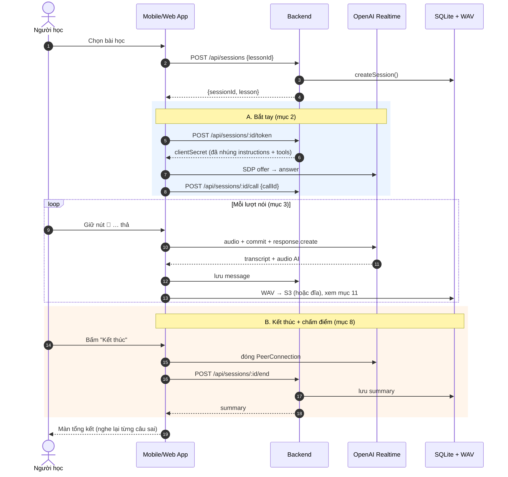
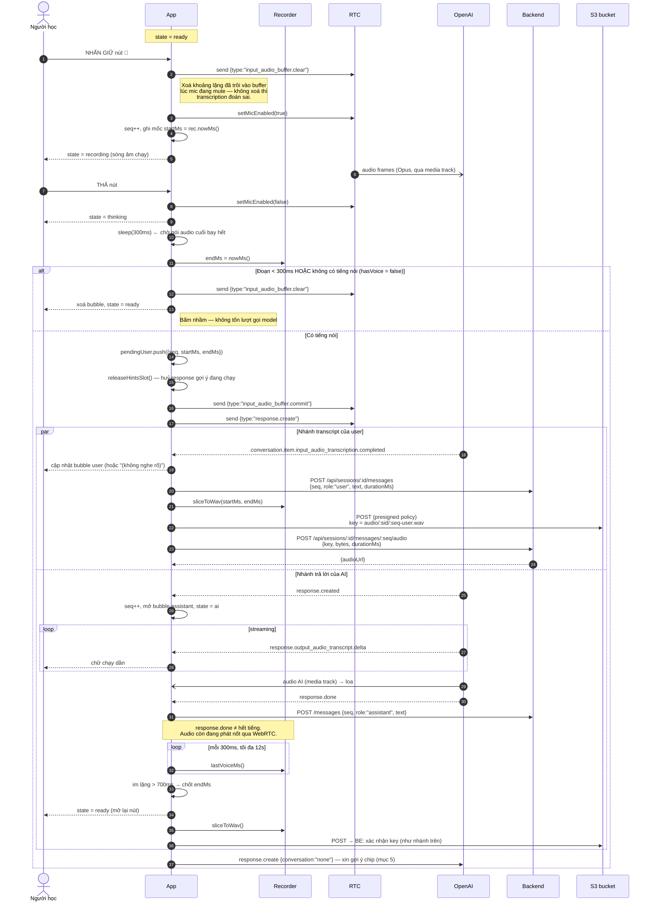
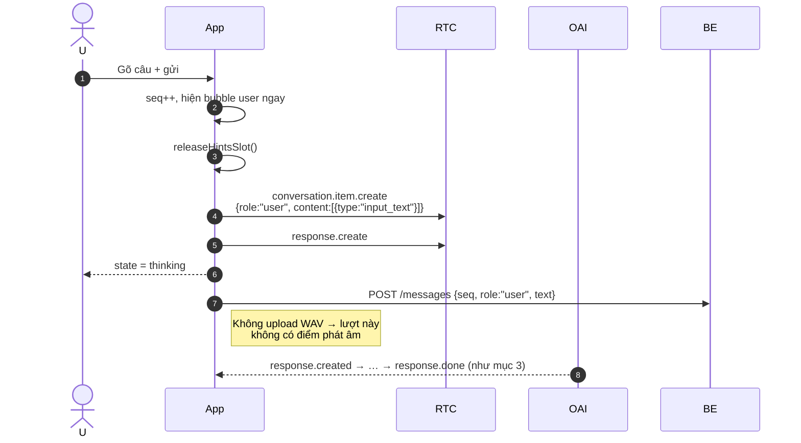
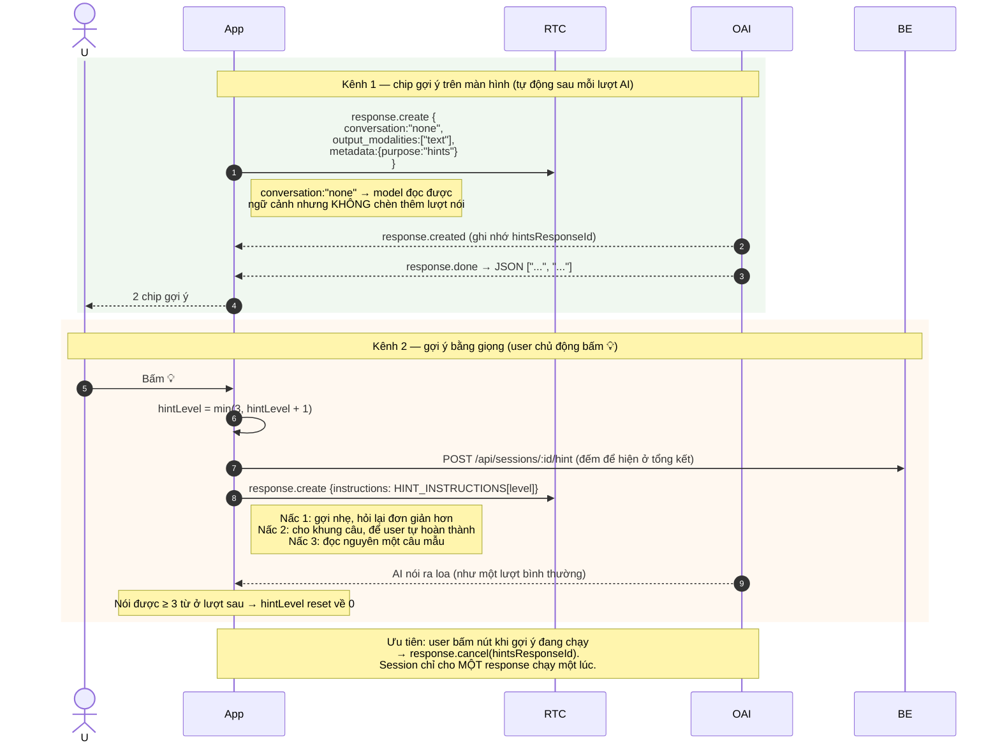
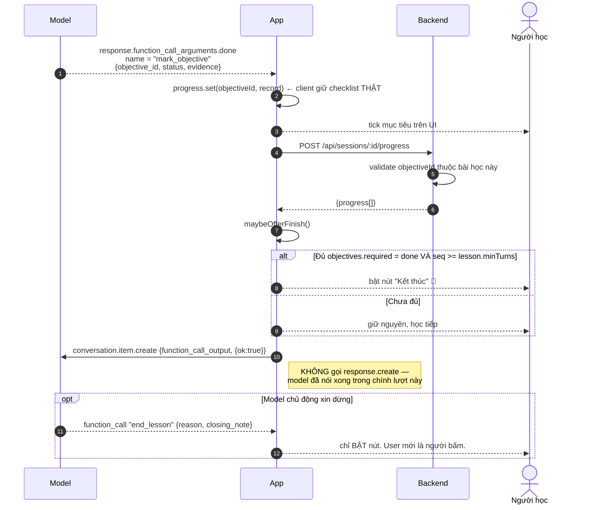
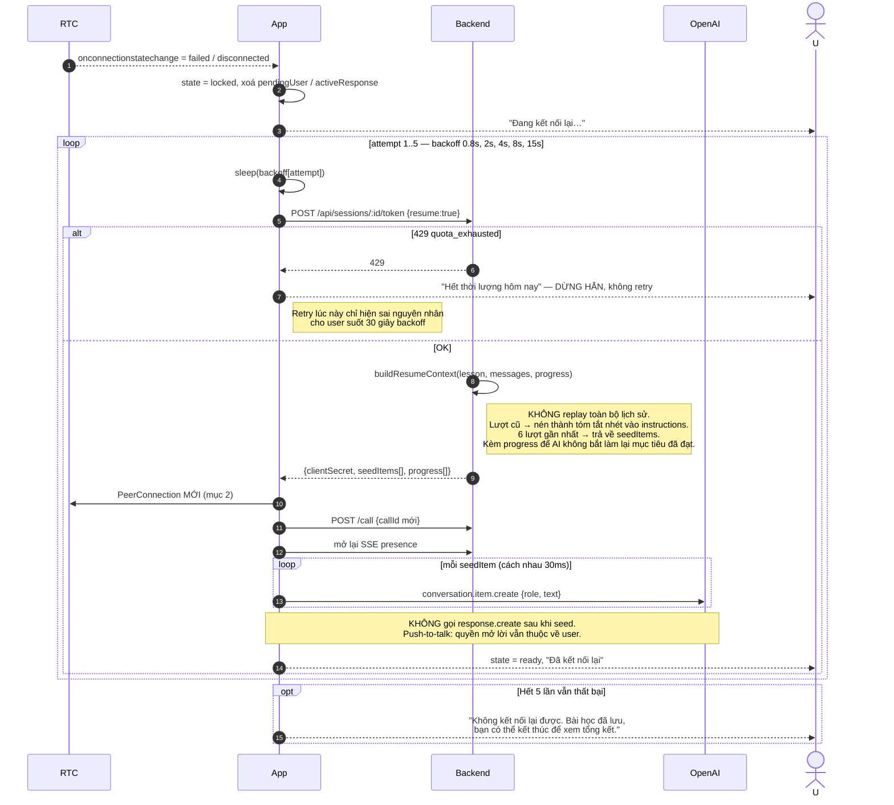
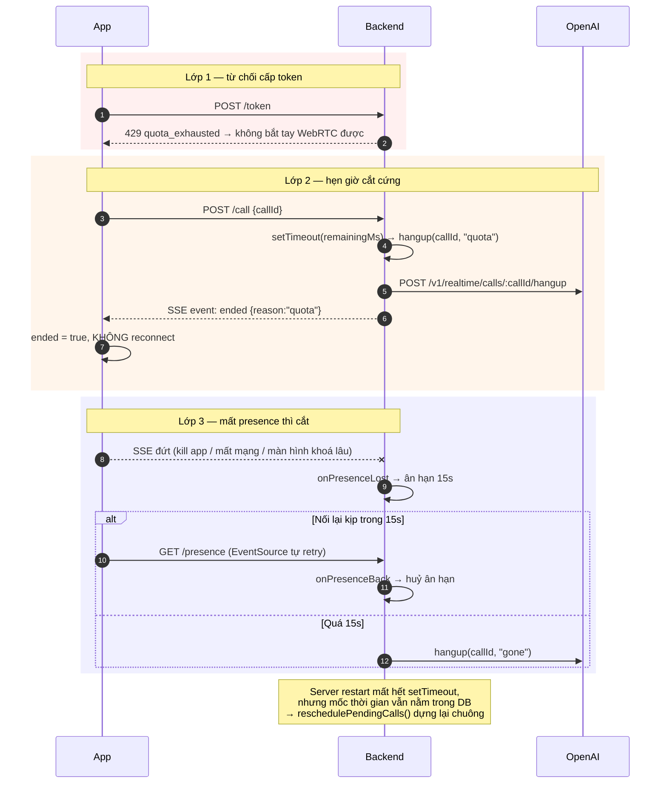
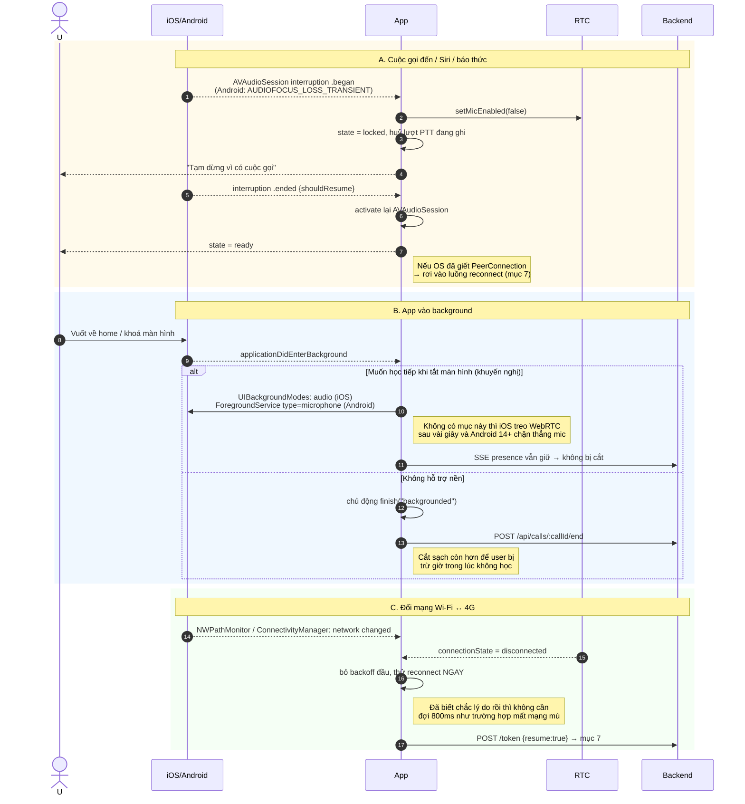
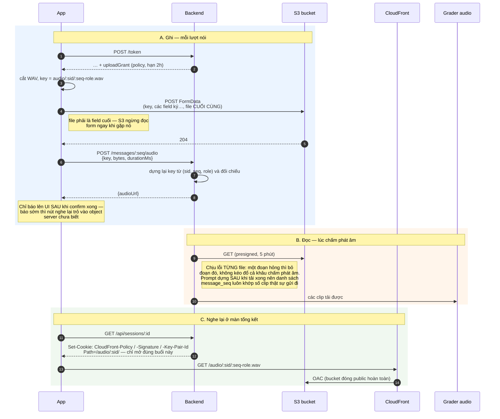

# Luồng AI Talk — sequence diagram (web + mobile app)

Tài liệu này mô tả luồng "nói chuyện với AI" của AI Learn dưới dạng sequence diagram,
viết cho trường hợp có **cả web và mobile app (iOS/Android native)** dùng chung backend.

Các diagram bám sát code hiện tại (`public/src/session.ts`, `public/src/realtime.ts`,
`server/index.ts`, `server/grader.ts`). Chỗ nào mobile phải làm khác web đều được ghi chú
bằng `Note over` hoặc nêu ở phần [Khác biệt web ↔ mobile](#khác-biệt-web--mobile).

---

## 0. Các nhân vật

| Ký hiệu | Là gì | Web | Mobile |
|---|---|---|---|
| **App** | UI + điều phối buổi học | `main.ts` + `LessonSession` | ViewModel / Bloc + `LessonSession` port sang Swift/Kotlin |
| **RTC** | Transport WebRTC thuần | `RealtimeConnection` (browser RTCPeerConnection) | libwebrtc (`WebRTC.framework` / `org.webrtc`) |
| **Rec** | Ghi PCM liên tục + cắt WAV | 2× `AudioWorklet` | `AVAudioEngine` tap / `JavaAudioDeviceModule.SamplesReadyCallback` |
| **BE** | Backend Node | `server/index.ts` | như nhau |
| **DB** | SQLite + chỗ để WAV (đĩa hoặc S3, xem [mục 11](#11-lưu-trữ-audio-client-tự-đẩy-thẳng-lên-s3)) | như nhau | như nhau |
| **OAI** | OpenAI Realtime API (WebRTC) | như nhau | như nhau |
| **Grader** | Chấm điểm sau buổi | `server/grader.ts` | như nhau |

Điểm quan trọng về kiến trúc, đúng cho cả hai nền tảng:

> **Media đi thẳng client ↔ OpenAI. Backend không nằm trên đường audio.**
> Với `AUDIO_STORE=s3` thì cả đường lưu trữ cũng vậy: client `POST` file thẳng lên bucket, backend
> chỉ nhận metadata. Backend giữ: mint ephemeral token, cấp quyền ghi, lưu transcript, đếm hạn mức,
> cắt cuộc gọi, chấm điểm.
> Trạng thái bài học nằm ở server; WebRTC chỉ là đường truyền — mất kết nối chỉ mất đường truyền.

---

## 1. Tổng quan một buổi học



---

## 2. Bắt tay: tạo session → mint token → WebRTC

Đây là chỗ mobile khác web nhiều nhất (định danh, quyền micro, audio session).

```mermaid
sequenceDiagram
    autonumber
    actor U as Người học
    participant App
    participant Rec as Recorder
    participant RTC as WebRTC layer
    participant BE as Backend
    participant OAI as OpenAI

    U->>App: Bấm "Bắt đầu"

    Note over App: MOBILE — làm trước khi đụng WebRTC<br/>1. Xin quyền micro (NSMicrophoneUsageDescription / RECORD_AUDIO)<br/>2. AVAudioSession .playAndRecord + .voiceChat + defaultToSpeaker<br/>   (Android: MODE_IN_COMMUNICATION, setSpeakerphoneOn)<br/>3. Đăng ký interruption observer (mục 9)
    App->>App: getUserMedia / AVAudioEngine start
    App->>Rec: TrackRecorder.create(mic)

    App->>BE: POST /api/sessions/:id/token {resume:false}
    Note over BE: Layer 1 chặn hạn mức:<br/>quotaFor(userId).remainingMs <= 0<br/>→ 429 {code:"quota_exhausted"}
    BE->>BE: buildInstructions(lesson, progress)
    BE->>OAI: POST /v1/realtime/client_secrets<br/>{instructions, tools, whisper-1,<br/> turn_detection:null, voice, speed}
    Note over BE: speed = lesson.speed (0.25–1.5).<br/>Người học đè lên bằng session.update<br/>giữa các lượt — API không cho đổi<br/>giữa chừng một câu đang nói.
    OAI-->>BE: {value, expires_at}
    BE-->>App: {clientSecret, model, seedItems[], progress[], uploadGrant}
    Note over BE,App: uploadGrant = presigned POST policy cho CẢ buổi:<br/>starts-with $key → audio/&lt;sessionId&gt;/, 45..5MB, hạn 2h.<br/>Cấp lại mỗi lần xin token nên reconnect luôn có bản còn hạn.<br/>null = server đang lưu audio trên đĩa.

    Note over App,OAI: API key thật không bao giờ rời server.<br/>App chỉ cầm secret ngắn hạn, không sửa được luật bài học.

    App->>RTC: connect(clientSecret, micStream)
    RTC->>RTC: addTrack(mic) + createDataChannel("oai-events")
    RTC->>RTC: createOffer → setLocalDescription → chờ ICE (tối đa 2s)
    RTC->>OAI: POST /v1/realtime/calls<br/>Authorization: Bearer <clientSecret><br/>Content-Type: application/sdp
    OAI-->>RTC: 201 + SDP answer<br/>Header Location: /v1/realtime/calls/rtc_xxx
    RTC->>RTC: callId = Location.split("/").pop()
    RTC->>RTC: setRemoteDescription(answer) → chờ DataChannel "open"

    OAI-->>RTC: ontrack (audio AI)
    RTC-->>App: onRemoteStream
    App->>Rec: TrackRecorder.create(remote track)
    Note over App: MOBILE: không có <audio srcObject>.<br/>libwebrtc tự phát ra loa qua AudioDeviceModule.<br/>Ghi track AI: RTCAudioRenderer (iOS) /<br/>AudioTrackSink (Android), không phải WebAudio.

    App->>RTC: setMicEnabled(false)
    Note over App,RTC: Push-to-talk: track vẫn nằm trong SDP,<br/>chỉ mute → không phải renegotiate.

    App->>BE: POST /api/sessions/:id/call {callId}
    BE->>BE: scheduleHangup(callId, remainingMs)  ← Layer 2
    BE-->>App: quota
    App->>BE: GET /api/calls/:callId/presence (SSE, giữ mở)
    BE-->>App: event: sync {usedMs, remainingMs, totalMs}

    App-->>U: PTT state = "ready" — micro sẵn sàng
```

---

## 3. Một lượt nói (push-to-talk) — luồng chính

VAD bị **tắt hoàn toàn** (`turn_detection: null`). Client là nơi duy nhất chốt một lượt.



**Vì sao không dùng `MediaRecorder.start()/stop()` theo từng lượt (và trên mobile là
`AVAudioRecorder` / `MediaRecorder`):** recorder khởi động chậm hơn tiếng nói ~100–200ms nên luôn
cụt đầu câu. Thay vào đó ghi PCM 16kHz **liên tục** vào ring buffer, cắt sau bằng timestamp.

---

## 4. Nhánh gõ chữ (không nói)

Đường này không đi qua transcribe nào cả — miễn nhiễm với chuyện nghe sót. Đổi lại lượt này
không được chấm phát âm.



---

## 5. Hai kênh gợi ý



---

## 6. Điểm dừng: model đề xuất, client mới chốt

Ba lớp, cố ý không giao hết cho model.



---

## 7. Reconnect (rất quan trọng với mobile)

Web mất mạng là chuyện hiếm. Mobile thì đi thang máy, chuyển Wi-Fi ↔ 4G, tàu điện ngầm — luồng này
sẽ chạy thường xuyên hơn nhiều.



> **Audio của message cũ không nạp lại được vào session realtime mới — chỉ nạp text.**
> Không sao: audio cũ vẫn nằm nguyên trong DB để phát lại ở màn tổng kết.

---

## 8. Kết thúc + chấm điểm

```mermaid
sequenceDiagram
    autonumber
    actor U
    participant App
    participant RTC
    participant BE as Backend
    participant DB
    participant GT as Grader text (gpt-4o)
    participant GA as Grader audio (gpt-4o-audio-preview)

    U->>App: Bấm "Kết thúc"

    rect rgb(245, 245, 255)
        Note over App,BE: stop() — tách khỏi chấm điểm để chấm hỏng còn retry được
        App->>App: đóng SSE presence
        App->>RTC: close() (closing=true → KHÔNG kích hoạt reconnect)
        App->>BE: POST /api/calls/:callId/end
        BE->>DB: endCall(reason:"client") — trừ giờ ngay, không đợi hết ân hạn
        App->>App: await Promise.allSettled(pendingUploads)<br/>race với timeout 5s
        Note right of App: Trước là sleep(400ms) — một con số đoán.<br/>Đường S3 có hai chặng (POST bucket rồi confirm)<br/>cộng retry nên không đoán nổi nữa; đợi đúng<br/>hàng đợi, kèm trần cứng để mạng chết không<br/>treo màn tổng kết.
        App->>App: stop recorders, stop mic tracks, close AudioContext
        Note over App: MOBILE: deactivate AVAudioSession /<br/>abandonAudioFocus, nếu không thì<br/>nhạc nền của app khác không quay lại được
    end

    App-->>U: "Đang chấm điểm…"
    App->>BE: POST /api/sessions/:id/end {reason}
    BE->>DB: listMessages() + listProgress()

    par Promise.allSettled — hỏng một nhánh vẫn còn nhánh kia
        BE->>GT: transcript + rubric → structured output JSON
        GT-->>BE: {grammar, vocabulary, fluency, objectives, errors[]}
    and
        BE->>GA: các file WAV của user (raw audio)
        GA-->>BE: {pronunciation, errors[] có message_seq}
        Note right of GA: Chấm phát âm từ transcript text là không<br/>đáng tin — ASR đã "sửa hộ" người học rồi
    end

    BE->>DB: endSession(id, reason, summary)
    BE-->>App: {summary}
    App-->>U: Màn tổng kết

    U->>App: Bấm vào một lỗi
    App->>BE: GET /audio/:sessionId/:seq-user.wav
    Note right of App: Mỗi lỗi gắn message_seq → nghe lại đúng câu đó
```

---

## 9. Cưỡng chế hạn mức — 3 lớp độc lập

Hỏng một lớp vẫn còn hai lớp kia. **Lớp 3 phải CẮT chứ không được chỉ "ngừng đếm"**: kênh presence
và cuộc gọi WebRTC là hai kết nối độc lập — nếu mất presence chỉ làm đồng hồ dừng lại thì một app
sửa vài dòng có thể đóng presence mà vẫn giữ WebRTC chạy, thành ra gọi miễn phí vô hạn.
Trên mobile chuyện này còn dễ hơn web (app đã ở trên máy người dùng). Không tin, mà cắt.



---

## 10. Vòng đời riêng của mobile app

Ba tình huống web không có. Đây là phần **phải viết thêm** khi port sang mobile.



---

## 11. Lưu trữ audio: client tự đẩy thẳng lên S3

`AUDIO_STORE=disk` (mặc định) giữ nguyên luồng cũ: WAV đi xuyên qua backend rồi nằm ở
`data/audio/`. Phần dưới mô tả `AUDIO_STORE=s3`.

Nguyên tắc: **cấp quyền ghi một lần cho cả buổi, không ký lại từng file.** Presigned PUT ký gắn chết
vào một key cụ thể nên mỗi lượt nói phải hỏi server xin URL mới — thêm một round-trip ngay trên
đường nóng sau mỗi câu, và URL ngắn hạn thì background upload task của mobile gần như không kịp
dùng. Presigned POST ký theo **điều kiện** (`starts-with $key`) nên một chữ ký phủ hết buổi.



**Hai lớp chặn khi ghi, cố ý không tin client:**

| Lớp | Ở đâu | Chặn gì |
|---|---|---|
| Policy | S3 kiểm | Ghi ra ngoài `audio/<sessionId>/`, file < 45B hoặc > 5MB, sai `Content-Type` |
| `verifyKey` | `audio-store.ts` | Gán file vào nhầm `seq` / `role` trong chính session của mình |

**Chuyện phải chấp nhận:** server không gọi `HeadObject` để kiểm tra object có thật hay không —
thêm một round-trip cho mỗi message chỉ để biết trước điều mà grader tự xử lý được. Đổi lại, một
message có thể mang `audio_path` trỏ vào object không tồn tại; khâu chấm điểm bỏ qua nó và ghi log.

**Nếu sau này đổi sang R2:** R2 hỗ trợ presigned PUT tốt nhưng POST policy thì hạn chế hơn — lúc đó
phải quay lại kiểu ký từng file.

---

## Khác biệt web ↔ mobile

Backend **không cần đổi gì** ngoài hai chỗ được đánh dấu ⚠️.

| Việc | Web (hiện tại) | Mobile app |
|---|---|---|
| Định danh thiết bị | ⚠️ Cookie `did` (httpOnly) | Cookie không tự nhiên trên native → gửi `Authorization: Bearer <token>` hoặc `X-Device-Id` lấy từ Keychain/Keystore. Backend đọc header trước, fallback cookie |
| Kết nối WebRTC | `RTCPeerConnection` của browser | libwebrtc: `RTCPeerConnection` (iOS ObjC/Swift), `PeerConnection` (Android). API gần như 1-1 |
| Data channel | `dc.send(JSON)` | như nhau — `RTCDataChannel.sendData(RTCDataBuffer)` |
| Phát audio AI | `<audio srcObject>` | libwebrtc tự phát qua AudioDeviceModule; chỉ cần cấu hình AVAudioSession / AudioManager |
| Ghi PCM để cắt WAV | 2× `AudioWorklet` (mic + remote) | iOS: `AVAudioEngine.inputNode` tap + `RTCAudioRenderer` cho remote track. Android: `JavaAudioDeviceModule.setSamplesReadyCallback` + `AudioTrackSink`. Cùng ý tưởng: ring buffer PCM 16kHz, cắt bằng timestamp |
| Echo cancellation | `getUserMedia {echoCancellation:true}` | Bật AEC cấp OS: `.voiceChat` mode (iOS) / `JavaAudioDeviceModule` builtin AEC+NS (Android). Quan trọng hơn web vì loa ngoài |
| Kênh presence | `EventSource` (tự retry) | Không có `EventSource` native → SSE thủ công (`URLSession.bytes` / OkHttp streaming) **và tự viết vòng retry**, hoặc đổi sang WebSocket. ⚠️ Nếu đổi WS thì backend thêm route |
| Upload WAV | `FormData` + `fetch` thẳng lên S3 | `URLSession.uploadTask(fromFile:)` / OkHttp `MultipartBody`, cũng thẳng lên S3. Nên dùng background upload task để đóng app giữa chừng vẫn đẩy nốt — grant sống 2h nên kịp |
| Nghe lại ở tổng kết | `<audio src>` + signed cookie (trình duyệt tự đính kèm) | Native không có cookie jar → backend ký thẳng vào URL khi request mang `X-Device-Id`. Cùng key pair, khác cơ chế |
| Quyền micro | Prompt của browser | Xin trước khi vào màn học, có màn giải thích + đường dẫn tới Settings khi bị từ chối vĩnh viễn |
| Vòng đời | Tab đóng là xong | Interruption, background, đổi mạng — xem mục 10 |

### Hai thay đổi backend cần cho mobile

1. **Định danh không phụ thuộc cookie** — `deviceId()` trong `server/index.ts` hiện chỉ đọc cookie
   `did`. Thêm nhánh đọc `X-Device-Id` / bearer token trước khi fallback về cookie. Hạn mức
   (`quotaFor(userId)`) và toàn bộ phần còn lại giữ nguyên.
2. **Static file `/audio/...`** (đường `disk`) vẫn phục vụ không kiểm tra chủ sở hữu. Web thì URL
   khó đoán, nhưng khi mobile phát audio qua player riêng nên chốt luôn: kiểm tra session thuộc về
   `deviceId` của request. Đường `s3` thì không còn vấn đề này — chữ ký ràng theo đúng một session.

### Có thể dùng lại nguyên xi

Toàn bộ `LessonSession` là logic thuần (state machine PTT, backoff, hint escalation, điểm dừng,
cắt/upload audio) — không đụng DOM. Nếu làm mobile bằng React Native / Flutter thì port gần như
copy; nếu native thì đây là bản đặc tả để viết lại trong Swift/Kotlin.
