# Luồng AI Talk — sequence diagram (web + mobile app)

Tài liệu này mô tả toàn bộ các luồng của AI Learn dưới dạng sequence diagram, viết cho trường hợp
có **cả web và mobile app (iOS/Android native)** dùng chung backend.

Các diagram bám sát code hiện tại: `public/src/main.ts`, `session.ts`, `realtime.ts`, `recorder.ts`,
`speech-queue.ts`, `polly-client.ts`, `fake-mouth.ts`, `talk-avatar.ts`, `shared/chunk.ts`,
`server/index.ts`, `prompt.ts`, `tools.ts`, `sts.ts`, `audio-store.ts`, `grader.ts`, `db.ts`.
Chỗ nào mobile phải làm khác web đều được ghi chú bằng `Note over` hoặc nêu ở
[mục 16](#16-khác-biệt-web--mobile).

---

## Hai điều phải biết trước khi đọc diagram nào

**1. Tiếng nói của AI có hai đường, người học chọn lúc bắt đầu bài.** Mode khoá cho cả buổi ở cột
`session.voice_mode`; server chốt, client chỉ đọc lại từ token (`shared/voice-mode.ts`).

- **`polly` (mặc định)** — session chạy `output_modalities: ["text"]`, OpenAI chỉ nghe audio và trả
  về chữ. Client gom chữ thành từng khúc, tự ký SigV4 và gọi thẳng Amazon Polly để lấy mp3, rồi tự
  phát qua một thẻ `<audio>`.
- **`openai`** — session chạy `output_modalities: ["audio"]` kèm `audio.output.{voice, speed}`.
  OpenAI phát audio về bằng media track, client cắm thẳng track đó vào **chính thẻ `<audio>` đó**
  bằng `srcObject`. Một thẻ cho cả hai mode là cố ý: `fake-mouth.ts` chỉ tạo được đúng một source
  node trên một thẻ, vĩnh viễn.

> Vì sao `polly` là mặc định: lý do **ban đầu** là khẩu hình (Realtime API không phát ra viseme nào,
> còn Polly trả speech marks). Lý do đó **đã hết** — avatar giờ nhép fake từ biên độ audio
> ([mục 6](#6-avatar-nhép-mồm--fake-từ-biên-độ)), không hỏi Polly gì về âm vị nữa. Còn lại đúng một
> lý do, và nó là lý do lớn: **tiền**. Mode `openai` làm tổng hoá đơn tăng ~2,1 lần — xem
> [`cost.md`](cost.md) mục 6.

Phần **transcribe tiếng người học không phụ thuộc mode**: cả hai đều chạy `whisper-1` với cùng
`prompt` chống bịa, và audio của học viên đều đi thẳng lên Realtime qua WebRTC. Mode chỉ đổi đường
tiếng AI **đi ra**.

Hệ quả trong tài liệu này: các diagram mô tả mode `polly`. Mode `openai` có thêm một media track
chiều về — nhưng vẫn **không** có vòng dò im lặng: "AI nói xong" lấy từ event
`output_audio_buffer.stopped` (chỉ có trên WebRTC, phát sau `response.done` khi server đã xả hết
buffer). Có `TrackRecorder` cho AI, nhưng chỉ khi bật công tắc "Lưu giọng AI" — mặc định tắt thì
không có AudioWorklet nào chạy cho AI cả. Chỉ đoạn ghi của **người học** mới được lưu mặc định — nghe
lại câu AI thì đọc lại bằng Polly.

**2. Media đi thẳng client ↔ nhà cung cấp. Backend không nằm trên đường audio.** Đúng cho cả ba
chặng: audio lên OpenAI qua WebRTC, tiếng nói lấy từ Polly (client tự ký bằng credential tạm), và với
`AUDIO_STORE=s3` thì client `POST` file thẳng lên bucket. Backend giữ: mint ephemeral token, cấp
quyền ghi và quyền gọi Polly, lưu transcript, đếm hạn mức, cắt cuộc gọi, chấm điểm.

Trạng thái bài học nằm ở server; WebRTC chỉ là đường truyền — mất kết nối chỉ mất đường truyền.

---

## 0. Các nhân vật trong diagram

| Ký hiệu | Là gì | Web | Mobile |
|---|---|---|---|
| **App** | UI + điều phối buổi học | `main.ts` + `LessonSession` | ViewModel / Bloc + `LessonSession` port sang Swift/Kotlin |
| **RTC** | Transport WebRTC thuần | `RealtimeConnection` (browser `RTCPeerConnection`) | libwebrtc (`WebRTC.framework` / `org.webrtc`) |
| **Rec** | Ghi PCM 16kHz liên tục + cắt WAV — **chỉ micro** | 1× `AudioWorklet` (`recorder.ts`) | `AVAudioEngine` tap / `JavaAudioDeviceModule` |
| **TTS** | Cắt câu → Polly → phát theo thứ tự | `SpeechQueue` + `polly-client.ts` | port cùng logic; ký SigV4 bằng CryptoKit / `javax.crypto` |
| **Mouth** | Đọc biên độ `<audio>` → khẩu hình | `FakeMouthPlayer` + `Avatar` (Spine) | AVAudioEngine tap trên player / Visualizer |
| **P** | Amazon Polly | client gọi thẳng | như nhau |
| **BE** | Backend Node (zero dependency) | `server/index.ts` | như nhau |
| **DB** | SQLite + chỗ để audio (đĩa hoặc S3) | như nhau | như nhau |
| **OAI** | OpenAI Realtime API (WebRTC) | như nhau | như nhau |
| **STS** | AWS STS — mint credential tạm cho Polly | `server/sts.ts` | như nhau |
| **Grader** | Chấm điểm sau buổi | `server/grader.ts` | như nhau |

---

## 1. Tổng quan một buổi học

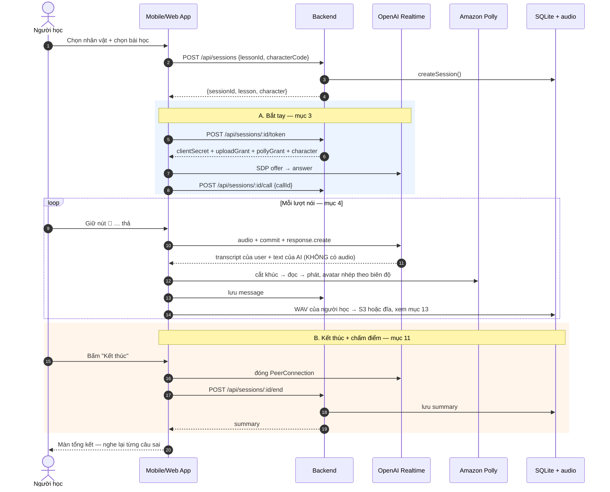
```mermaid
sequenceDiagram
    autonumber
    actor U as Người học
    participant App as Mobile/Web App
    participant BE as Backend
    participant OAI as OpenAI Realtime
    participant P as Amazon Polly
    participant DB as SQLite + audio

    U->>App: Chọn nhân vật + chọn bài học
    App->>BE: POST /api/sessions {lessonId, characterCode}
    BE->>DB: createSession()
    BE-->>App: {sessionId, lesson, character}

    rect rgb(235, 244, 255)
        Note over App,OAI: A. Bắt tay — mục 3
        App->>BE: POST /api/sessions/:id/token
        BE-->>App: clientSecret + uploadGrant + pollyGrant + character
        App->>OAI: SDP offer → answer
        App->>BE: POST /api/sessions/:id/call {callId}
    end

    loop Mỗi lượt nói — mục 4
        U->>App: Giữ nút 🎤 … thả
        App->>OAI: audio + commit + response.create
        OAI-->>App: transcript của user + text của AI (KHÔNG có audio)
        App->>P: cắt khúc → đọc → phát, avatar nhép theo biên độ
        App->>BE: lưu message
        App->>DB: WAV của người học → S3 hoặc đĩa, xem mục 13
    end

    rect rgb(255, 245, 235)
        Note over App,DB: B. Kết thúc + chấm điểm — mục 11
        U->>App: Bấm "Kết thúc"
        App->>OAI: đóng PeerConnection
        App->>BE: POST /api/sessions/:id/end
        BE->>DB: lưu summary
        BE-->>App: summary
    end

    App-->>U: Màn tổng kết — nghe lại từng câu sai
```

---

## 2. Trang chủ: chọn nhân vật, chọn bài, hoặc học tiếp

Nhân vật là **nguồn duy nhất** cho giọng đọc, hệ số tốc độ và asset avatar. Đổi nhân vật không chỉ
đổi ảnh: `personality` / `voiceStyle` / `greetingStyle` đi thẳng vào `instructions`
(`server/prompt.ts`), đặt **trước** kịch bản bài học.

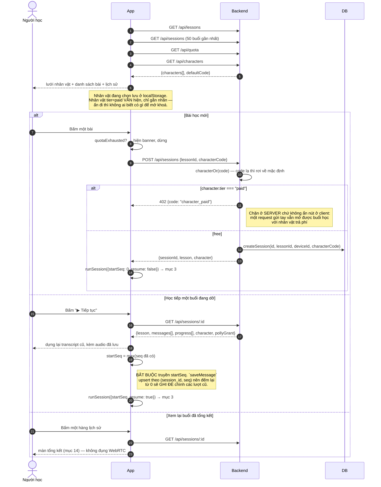
```mermaid
sequenceDiagram
    autonumber
    actor U as Người học
    participant App
    participant BE as Backend
    participant DB

    App->>BE: GET /api/lessons
    App->>BE: GET /api/sessions (50 buổi gần nhất)
    App->>BE: GET /api/quota
    App->>BE: GET /api/characters
    BE-->>App: {characters[], defaultCode}
    App-->>U: lưới nhân vật + danh sách bài + lịch sử

    Note over App: Nhân vật đang chọn lưu ở localStorage.<br/>Nhân vật tier=paid VẪN hiện, chỉ gắn nhãn —<br/>ẩn đi thì không ai biết có gì để mở khoá.

    alt Bài học mới
        U->>App: Bấm một bài
        App->>App: quotaExhausted? → hiện banner, dừng
        App->>BE: POST /api/sessions {lessonId, characterCode}
        BE->>BE: characterOr(code) — code lạ thì rơi về mặc định
        alt character.tier === "paid"
            BE-->>App: 402 {code: "character_paid"}
            Note right of BE: Chặn ở SERVER chứ không ẩn nút ở client:<br/>một request gửi tay vẫn mở được buổi học<br/>với nhân vật trả phí
        else free
            BE->>DB: createSession(id, lessonId, deviceId, characterCode)
            BE-->>App: {sessionId, lesson, character}
            App->>App: runSession({startSeq: 0, resume: false}) → mục 3
        end

    else Học tiếp một buổi đang dở
        U->>App: Bấm "▶ Tiếp tục"
        App->>BE: GET /api/sessions/:id
        BE-->>App: {lesson, messages[], progress[], character, pollyGrant}
        App-->>U: dựng lại transcript cũ, kèm audio đã lưu
        App->>App: startSeq = max(seq đã có)
        Note right of App: BẮT BUỘC truyền startSeq. `saveMessage`<br/>upsert theo (session_id, seq) nên đếm lại<br/>từ 0 sẽ GHI ĐÈ chính các lượt cũ.
        App->>App: runSession({startSeq, resume: true}) → mục 3

    else Xem lại buổi đã tổng kết
        U->>App: Bấm một hàng lịch sử
        App->>BE: GET /api/sessions/:id
        App-->>U: màn tổng kết (mục 14) — không đụng WebRTC
    end
```

> Buổi đang dở thì UI **tách hai hành động** ra hai nút riêng ("Tiếp tục" và "Xem lại"). Gộp làm một
> thì lỡ tay là nối lại WebRTC — tốn hạn mức — trong khi người học chỉ định xem lại.

---

## 3. Bắt tay: token → WebRTC → presence

Đây là chỗ mobile khác web nhiều nhất: định danh, quyền micro, audio session.

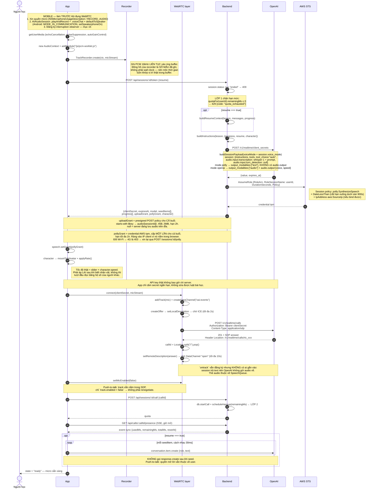
```mermaid
sequenceDiagram
    autonumber
    actor U as Người học
    participant App
    participant Rec as Recorder
    participant RTC as WebRTC layer
    participant BE as Backend
    participant OAI as OpenAI
    participant STS as AWS STS

    Note over App: MOBILE — làm TRƯỚC khi đụng WebRTC<br/>1. Xin quyền micro (NSMicrophoneUsageDescription / RECORD_AUDIO)<br/>2. AVAudioSession .playAndRecord + .voiceChat + defaultToSpeaker<br/>   (Android: MODE_IN_COMMUNICATION, setSpeakerphoneOn)<br/>3. Đăng ký interruption observer — mục 15

    App->>App: getUserMedia {echoCancellation, noiseSuppression, autoGainControl}
    App->>App: new AudioContext + addModule("/js/pcm-worklet.js")
    App->>Rec: TrackRecorder.create(ctx, micStream)
    Note right of Rec: Ghi PCM 16kHz LIÊN TỤC vào ring buffer.<br/>Đồng hồ của recorder là SỐ MẪU đã ghi,<br/>không phải wall clock — nên mốc thời gian<br/>luôn khớp vị trí thật trong buffer.

    App->>BE: POST /api/sessions/:id/token {resume}
    BE->>BE: session.status === "ended" → 409
    Note over BE: LỚP 1 chặn hạn mức:<br/>quotaFor(userId).remainingMs ≤ 0<br/>→ 429 {code: "quota_exhausted"}

    opt resume === true
        BE->>BE: buildResumeContext(lesson, messages, progress)
    end

    BE->>BE: buildInstructions(lesson, {progress, resume, character})
    BE->>OAI: POST /v1/realtime/client_secrets
    Note over BE,OAI: buildSessionPayload(voiceMode = session.voice_mode)<br/>session: {instructions, tools, tool_choice:"auto",<br/>audio.input.transcription: whisper-1 + prompt,<br/>audio.input.turn_detection: null}<br/>mode polly → output_modalities:["text"], KHÔNG có audio.output<br/>mode openai → output_modalities:["audio"] + audio.output:{voice, speed}
    OAI-->>BE: {value, expires_at}

    BE->>STS: AssumeRole {RoleArn, RoleSessionName: userId,<br/>DurationSeconds, Policy}
    Note right of STS: Session policy: polly:SynthesizeSpeech<br/>+ DateLessThan (cắt hạn xuống dưới sàn 900s)<br/>+ IpAddress aws:SourceIp (nếu bind được)
    STS-->>BE: credential tạm

    BE-->>App: {clientSecret, expiresAt, model, seedItems[],<br/>progress[], uploadGrant, pollyGrant, character}
    Note over BE,App: uploadGrant = presigned POST policy cho CẢ buổi.<br/>starts-with $key → audio/[sessionId]/, 45B..5MB, hạn 2h.<br/>null = server đang lưu audio trên đĩa.
    Note over BE,App: pollyGrant = credential AWS tạm, cấp MỘT LẦN cho cả buổi,<br/>hạn tối đa 1h. Ràng vào IP client vì nó nằm trong browser.<br/>Đổi Wi-Fi ↔ 4G là 403 → xin lại qua POST /sessions/:id/polly.

    App->>App: speech.setGrant(pollyGrant)
    App->>App: character → mountTalkAvatar + applyRate()
    Note right of App: Tốc độ thật = slider × character.speed.<br/>Phải áp LẠI sau khi biết nhân vật, không thì<br/>lượt đầu đọc bằng hệ số của người khác.

    Note over App,OAI: API key thật không bao giờ rời server.<br/>App chỉ cầm secret ngắn hạn, không sửa được luật bài học.

    App->>RTC: connect(clientSecret, micStream)
    RTC->>RTC: addTrack(mic) + createDataChannel("oai-events")
    RTC->>RTC: createOffer → setLocalDescription → chờ ICE (tối đa 2s)
    RTC->>OAI: POST /v1/realtime/calls<br/>Authorization: Bearer clientSecret<br/>Content-Type: application/sdp
    OAI-->>RTC: 201 + SDP answer<br/>Header Location: /v1/realtime/calls/rtc_xxx
    RTC->>RTC: callId = Location.split("/").pop()
    RTC->>RTC: setRemoteDescription(answer) → chờ DataChannel "open" (tối đa 10s)

    Note over RTC,OAI: `ontrack` vẫn đăng ký nhưng KHÔNG có ai gắn vào:<br/>session trả text nên OpenAI không gửi audio về.<br/>Thẻ audio thuộc về SpeechQueue.

    App->>RTC: setMicEnabled(false)
    Note over App,RTC: Push-to-talk: track vẫn nằm trong SDP,<br/>chỉ `track.enabled = false` → không phải renegotiate.

    App->>BE: POST /api/sessions/:id/call {callId}
    BE->>BE: db.startCall + scheduleHangup(remainingMs)  ← LỚP 2
    BE-->>App: quota
    App->>BE: GET /api/calls/:callId/presence (SSE, giữ mở)
    BE-->>App: event sync {usedMs, remainingMs, totalMs, resetAt}

    opt resume === true
        loop mỗi seedItem, cách nhau 30ms
            App->>OAI: conversation.item.create {role, text}
        end
        Note over App,OAI: KHÔNG gọi response.create sau khi seed.<br/>Push-to-talk: quyền mở lời vẫn thuộc về user.
    end

    App-->>U: state = "ready" — micro sẵn sàng
```

**Vì sao `whisper-1` chứ không phải `gpt-4o-transcribe`:** `gpt-4o-transcribe` là một LLM, nó rút gọn
và dọn lỗi học viên trước khi trả chữ về. Với app luyện nói thì đó là **mất dữ liệu** — chính cái lỗi
bị dọn đi mới là thứ cần chấm. Đổi lại whisper bịa đặt trên đoạn ghi ngắn, và `prompt`
(`buildTranscriptionPrompt`) là thuốc giải duy nhất ở đây: Realtime API không nhận `temperature`.

---

## 4. Một lượt nói (push-to-talk) — luồng chính

VAD bị **tắt hoàn toàn** (`turn_detection: null`). Client là nơi duy nhất chốt một lượt.

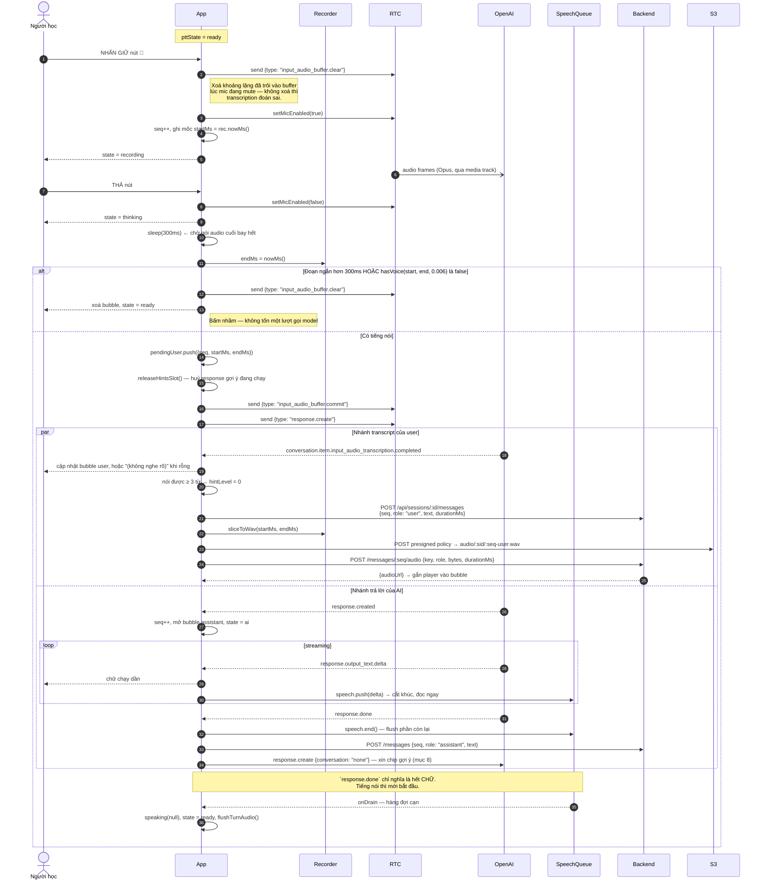
```mermaid
sequenceDiagram
    autonumber
    actor U as Người học
    participant App
    participant Rec as Recorder
    participant RTC
    participant OAI as OpenAI
    participant TTS as SpeechQueue
    participant BE as Backend
    participant S3

    Note over App: pttState = ready

    U->>App: NHẤN GIỮ nút 🎤
    App->>RTC: send {type: "input_audio_buffer.clear"}
    Note right of App: Xoá khoảng lặng đã trôi vào buffer<br/>lúc mic đang mute — không xoá thì<br/>transcription đoán sai.
    App->>RTC: setMicEnabled(true)
    App->>App: seq++, ghi mốc startMs = rec.nowMs()
    App-->>U: state = recording

    RTC-)OAI: audio frames (Opus, qua media track)

    U->>App: THẢ nút
    App->>RTC: setMicEnabled(false)
    App-->>U: state = thinking
    App->>App: sleep(300ms)  ← chờ gói audio cuối bay hết
    App->>Rec: endMs = nowMs()

    alt Đoạn ngắn hơn 300ms HOẶC hasVoice(start, end, 0.006) là false
        App->>RTC: send {type: "input_audio_buffer.clear"}
        App-->>U: xoá bubble, state = ready
        Note right of App: Bấm nhầm — không tốn một lượt gọi model
    else Có tiếng nói
        App->>App: pendingUser.push({seq, startMs, endMs})
        App->>App: releaseHintsSlot() — huỷ response gợi ý đang chạy
        App->>RTC: send {type: "input_audio_buffer.commit"}
        App->>RTC: send {type: "response.create"}

        par Nhánh transcript của user
            OAI-->>App: conversation.item.input_audio_transcription.completed
            App-->>U: cập nhật bubble user, hoặc "(không nghe rõ)" khi rỗng
            App->>App: nói được ≥ 3 từ → hintLevel = 0
            App->>BE: POST /api/sessions/:id/messages<br/>{seq, role: "user", text, durationMs}
            App->>Rec: sliceToWav(startMs, endMs)
            App->>S3: POST presigned policy → audio/:sid/:seq-user.wav
            App->>BE: POST /messages/:seq/audio {key, role, bytes, durationMs}
            BE-->>App: {audioUrl} → gắn player vào bubble
        and Nhánh trả lời của AI
            OAI-->>App: response.created
            App->>App: seq++, mở bubble assistant, state = ai
            loop streaming
                OAI-->>App: response.output_text.delta
                App-->>U: chữ chạy dần
                App->>TTS: speech.push(delta) → cắt khúc, đọc ngay
            end
            OAI-->>App: response.done
            App->>TTS: speech.end() — flush phần còn lại
            App->>BE: POST /messages {seq, role: "assistant", text}
            App->>OAI: response.create {conversation: "none"} — xin chip gợi ý (mục 8)
        end

        Note over App,TTS: `response.done` chỉ nghĩa là hết CHỮ.<br/>Tiếng nói thì mới bắt đầu.

        TTS-->>App: onDrain — hàng đợi cạn
        App->>App: speaking(null), state = ready, flushTurnAudio()
    end
```

Bốn tín hiệu **`error` / transcription thất bại** cũng phải có đường ra, nếu không nút micro khoá vĩnh viễn:

| Tình huống | Xử lý | Ở đâu |
|---|---|---|
| `error` từ server khi đang `thinking` và chưa có response | mở lại nút | `session.ts` `#handleEvent` |
| `input_audio_transcription.failed` | `pendingUser.shift()` — bỏ lượt đó | như trên |
| `response.done` mà không có `activeResponse` | `#unlockPtt()` | `#onResponseDone` |
| Hàng đợi đọc treo > 30s | failsafe: `cancel()` + `onDrain()` | `speech-queue.ts` |

**Vì sao không dùng `MediaRecorder.start()/stop()` theo từng lượt** (mobile là `AVAudioRecorder` /
`MediaRecorder`): recorder khởi động chậm hơn tiếng nói ~100–200ms nên luôn cụt đầu câu. Thay vào đó
ghi PCM 16kHz **liên tục** vào ring buffer, cắt sau bằng timestamp.

---

## 5. Đường tiếng nói: cắt khúc → Polly → phát

Toàn bộ độ trễ người học cảm thấy nằm ở **khúc đầu tiên**. Mọi thứ trong mục này tồn tại để rút ngắn
đúng cái khúc đó.

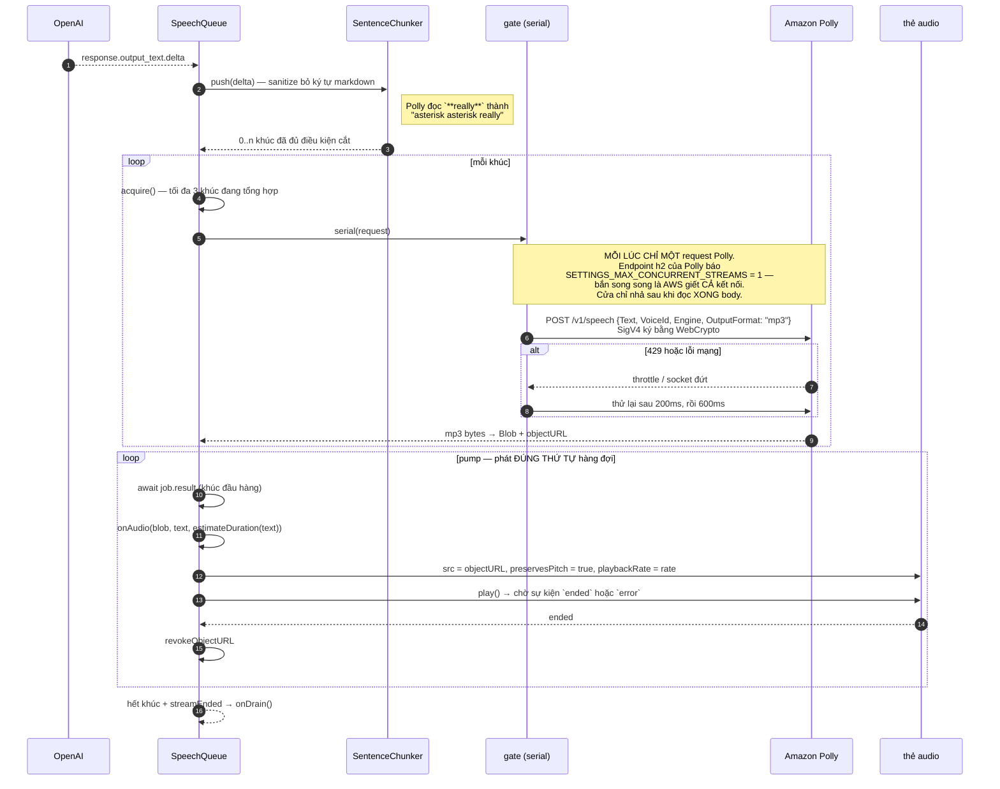
```mermaid
sequenceDiagram
    autonumber
    participant OAI as OpenAI
    participant Q as SpeechQueue
    participant C as SentenceChunker
    participant G as gate (serial)
    participant P as Amazon Polly
    participant A as thẻ audio

    OAI-->>Q: response.output_text.delta
    Q->>C: push(delta) — sanitize bỏ ký tự markdown
    Note right of C: Polly đọc `**really**` thành<br/>"asterisk asterisk really"
    C-->>Q: 0..n khúc đã đủ điều kiện cắt

    loop mỗi khúc
        Q->>Q: acquire() — tối đa 3 khúc đang tổng hợp
        Q->>G: serial(request)
        Note over G,P: MỖI LÚC CHỈ MỘT request Polly.<br/>Endpoint h2 của Polly báo<br/>SETTINGS_MAX_CONCURRENT_STREAMS = 1 —<br/>bắn song song là AWS giết CẢ kết nối.<br/>Cửa chỉ nhả sau khi đọc XONG body.
        G->>P: POST /v1/speech {Text, VoiceId, Engine, OutputFormat: "mp3"}<br/>SigV4 ký bằng WebCrypto
        alt 429 hoặc lỗi mạng
            P-->>G: throttle / socket đứt
            G->>P: thử lại sau 200ms, rồi 600ms
        end
        P-->>Q: mp3 bytes → Blob + objectURL
    end

    loop pump — phát ĐÚNG THỨ TỰ hàng đợi
        Q->>Q: await job.result (khúc đầu hàng)
        Q->>Q: onAudio(blob, text, estimateDuration(text))
        Q->>A: src = objectURL, preservesPitch = true, playbackRate = rate
        Q->>A: play() → chờ sự kiện `ended` hoặc `error`
        A-->>Q: ended
        Q->>Q: revokeObjectURL
    end

    Q-->>Q: hết khúc + streamEnded → onDrain()
```

### Luật cắt khúc bất đối xứng (`shared/chunk.ts`)

| | Ngưỡng |
|---|---|
| Khúc đầu | Dấu kết câu, hoặc `,;:—–`, hoặc ranh giới từ khi quá 40 ký tự — cái nào tới trước. Tối thiểu 15 ký tự |
| Khúc sau | Gom tới hết câu **và** ≥ 60 ký tự. Trần cứng 200 thì cắt ở dấu mềm gần nhất, rồi mới tới ranh giới từ |
| `response.done` | `flush()` — trả nốt phần còn lại bất kể dài ngắn |

Không được cắt nhầm ở `Mr.` `Dr.` `e.g.` `U.S.` hay số thập phân (`3.14`) — Polly đọc một mảnh câu
bằng ngữ điệu xuống giọng của câu hoàn chỉnh, nghe ra ngay. Trong lúc streaming, một dấu `.` ở cuối
buffer **chưa kết luận được gì**: nó có thể là hết câu, mà cũng có thể là `3.` đang chờ `14` chạy tới
— nên `findSentenceEnd` nhận cờ `atEnd`.

### Bốn quyết định dễ hiểu nhầm

| Quyết định | Vì sao |
|---|---|
| **Một** thẻ `<audio>` cho cả buổi, không phải hai luân phiên | Polly trả cả file một lúc và ta giữ Blob trong RAM — không còn gì để "tải trước". Và `createMediaElementSource` chỉ gọi được **một lần vĩnh viễn** cho mỗi element, nên hai thẻ là giết đường nhép mồm (mục 6) |
| Ký **nằm trong** cửa `serial`, không phải ngoài | Ký là vài phép HMAC. Ký ngoài thì thứ tự vào cửa tuỳ bên nào ký xong trước |
| `estimateDuration` ước từ **độ dài chữ** (~14 ký tự/giây) | Bỏ speech marks là mất mốc thời gian thật. Giải mã mp3 chỉ để biết độ dài thì quá đắt, còn `audio.duration` thì chỉ có sau khi gán `src`. Con số này chỉ chạy vào một chỗ: dòng thời lượng ở màn tổng kết |
| `waitForPlayback` chỉ nghe `ended` và `error` | `emptied` **cũng bắn khi gán `src`**, nên từng làm mỗi lần gán src bị hiểu nhầm là "phát xong" và khúc đang đọc bị cắt ngang. Đường huỷ gọi thẳng `finish()` chứ không mượn sự kiện nào |

**Một khúc hỏng không làm hỏng cả lượt:** bỏ khúc đó, hàng đợi chạy tiếp. Chữ đã hiện rồi nên người
học không mất nội dung.

**`cancel()` phải tăng `generation`.** Vòng phát có thể đang `await` một khúc lúc bị huỷ; không có
mốc này thì khi lần await đó trả về, nó chạy tiếp và phát khúc của **lượt sau** — hai vòng phát chồng
lên nhau trên cùng một thẻ `<audio>`.

### Đổi giọng và đổi tốc độ

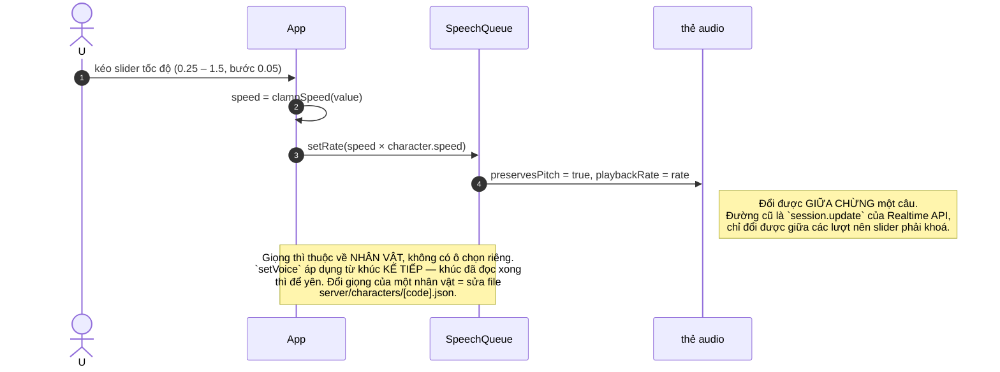
```mermaid
sequenceDiagram
    autonumber
    actor U
    participant App
    participant Q as SpeechQueue
    participant A as thẻ audio

    U->>App: kéo slider tốc độ (0.25 – 1.5, bước 0.05)
    App->>App: speed = clampSpeed(value)
    App->>Q: setRate(speed × character.speed)
    Q->>A: preservesPitch = true, playbackRate = rate
    Note right of A: Đổi được GIỮA CHỪNG một câu.<br/>Đường cũ là `session.update` của Realtime API,<br/>chỉ đổi được giữa các lượt nên slider phải khoá.

    Note over App,Q: Giọng thì thuộc về NHÂN VẬT, không có ô chọn riêng.<br/>`setVoice` áp dụng từ khúc KẾ TIẾP — khúc đã đọc xong<br/>thì để yên. Đổi giọng của một nhân vật = sửa file<br/>server/characters/[code].json.
```

`setGrant` mang theo giọng mặc định của server, nhưng chỉ là **điểm xuất phát**: nếu người học đã
chọn (`voiceChosen`) thì lần cấp grant sau — reconnect, hoặc xin lại vì hết hạn — không được âm thầm
kéo về mặc định.

### Grant hết hạn giữa chừng

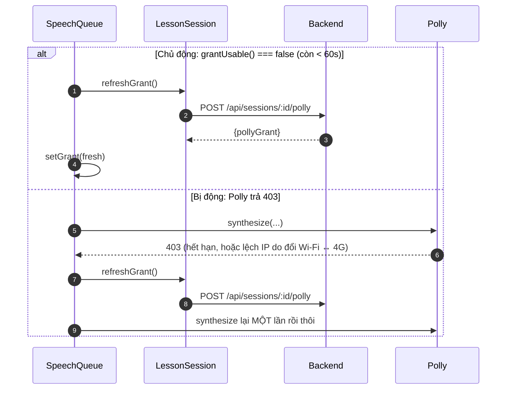
```mermaid
sequenceDiagram
    autonumber
    participant Q as SpeechQueue
    participant App as LessonSession
    participant BE as Backend
    participant P as Polly

    alt Chủ động: grantUsable() === false (còn < 60s)
        Q->>App: refreshGrant()
        App->>BE: POST /api/sessions/:id/polly
        BE-->>App: {pollyGrant}
        Q->>Q: setGrant(fresh)
    else Bị động: Polly trả 403
        Q->>P: synthesize(...)
        P-->>Q: 403 (hết hạn, hoặc lệch IP do đổi Wi-Fi ↔ 4G)
        Q->>App: refreshGrant()
        App->>BE: POST /api/sessions/:id/polly
        Q->>P: synthesize lại MỘT lần rồi thôi
    end
```

> Đường riêng chứ không gọi lại `/token`: `/token` mint một client secret mới của OpenAI và dựng lại
> cả ngữ cảnh resume — tất cả đều bị vứt đi nếu thứ ta cần chỉ là một credential AWS.

---

## 6. Avatar nhép mồm — fake, từ biên độ

> **Trung thực về thứ này là gì.** Trước đây khẩu hình đến từ speech marks của Polly, tức là đúng
> **âm vị**: chữ `p` ra hình mím môi, chữ `s` ra hình răng khép. Đường đó đã bỏ. Cái ở đây chỉ đọc
> **độ to** của tiếng rồi mở mồm theo — đúng **nhịp**, sai **âm vị**, và không có cách nào làm nó
> đúng âm vị cả.
>
> Đổi được vì màn "luyện khẩu hình" (nơi người học thật sự nhìn vào hình miệng để bắt chước) đã bỏ ở
> commit `89979c8`. Trong hội thoại AI nói ~150 từ/phút, không ai nhìn kịp từng khẩu hình, và việc
> duy nhất avatar đang làm là "có mặt cho sinh động".
>
> **Nếu sau này quay lại dạy phát âm bằng hình miệng thì phải bật lại speech marks** — đừng sửa
> `fake-mouth.ts` cho chính xác hơn, nó không thể chính xác hơn.

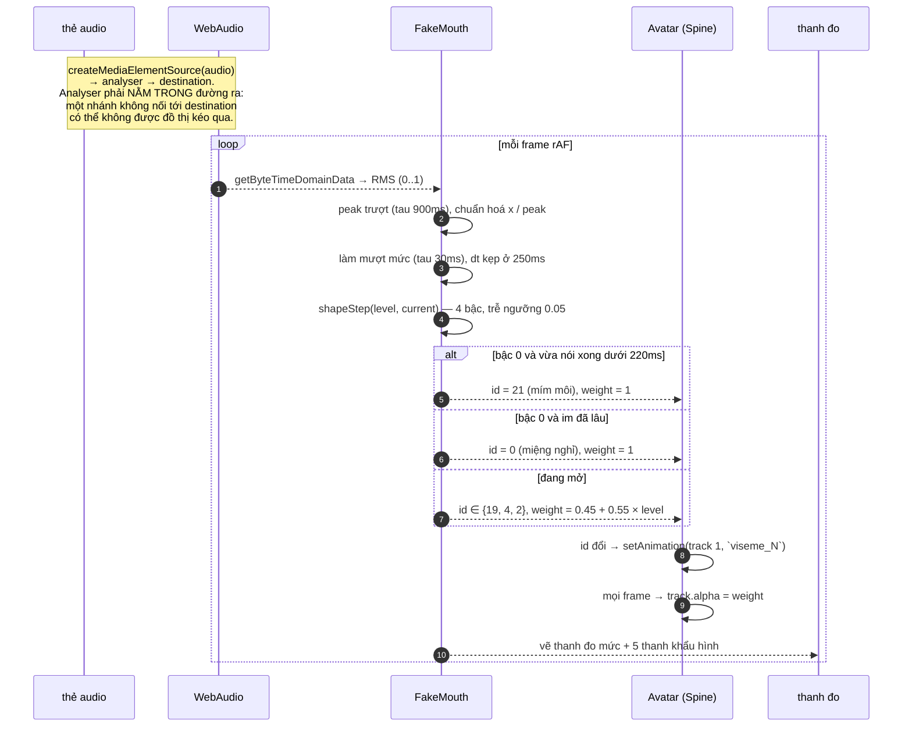
```mermaid
sequenceDiagram
    autonumber
    participant A as thẻ audio
    participant W as WebAudio
    participant M as FakeMouth
    participant S as Avatar (Spine)
    participant B as thanh đo

    Note over A,W: createMediaElementSource(audio)<br/>→ analyser → destination.<br/>Analyser phải NẰM TRONG đường ra:<br/>một nhánh không nối tới destination<br/>có thể không được đồ thị kéo qua.

    loop mỗi frame rAF
        W-->>M: getByteTimeDomainData → RMS (0..1)
        M->>M: peak trượt (tau 900ms), chuẩn hoá x / peak
        M->>M: làm mượt mức (tau 30ms), dt kẹp ở 250ms
        M->>M: shapeStep(level, current) — 4 bậc, trễ ngưỡng 0.05
        alt bậc 0 và vừa nói xong dưới 220ms
            M-->>S: id = 21 (mím môi), weight = 1
        else bậc 0 và im đã lâu
            M-->>S: id = 0 (miệng nghỉ), weight = 1
        else đang mở
            M-->>S: id ∈ {19, 4, 2}, weight = 0.45 + 0.55 × level
        end
        S->>S: id đổi → setAnimation(track 1, `viseme_N`)
        S->>S: mọi frame → track.alpha = weight
        M-->>B: vẽ thanh đo mức + 5 thanh khẩu hình
    end
```

**Hai track là bắt buộc.** `Idle*` và `Blink` chạy track 0, viseme chạy track 1 — vì `Idle` cũng
animate chính các bone miệng. Nhét chung một track thì mồm vừa nhép vừa bị Idle kéo.

**Chuẩn hoá theo đỉnh trượt, không đọc biên độ tuyệt đối.** Polly không chuẩn hoá loudness giữa các
giọng và người học còn kéo được volume; đọc thẳng thì giọng nhỏ tiếng nhép hời hợt cả buổi còn giọng
to tiếng hạ hàm mỗi âm tiết.

**Ba cái bẫy, cả ba đều biểu hiện giống hệt "Polly hỏng":**

| Bẫy | Triệu chứng |
|---|---|
| `createMediaElementSource` **cắt** tiếng ra khỏi loa | Quên `connect(destination)` là câm hoàn toàn, console không có lỗi nào |
| Mỗi `<audio>` chỉ tạo được **một** source node, vĩnh viễn | Gọi lần hai ném `InvalidStateError`. Chạy được là nhờ `SpeechQueue` đã chọn đúng một thẻ cho cả buổi |
| `AudioContext` sinh ra ở trạng thái `suspended` | Không `resume()` thì biên độ đọc về toàn 0 và mồm đứng im **trong khi tai vẫn nghe thấy tiếng** |

`playbackRate` 0.5× thì không phải lo: chính thẻ `<audio>` giãn thời gian, WebAudio cắm vào **sau**
đó nên mồm tự chậm theo.

> **Thanh đo luôn vẽ**, kể cả khi nhân vật chưa có asset. Khi mồm avatar đứng im, đây là cách duy
> nhất phân biệt "dữ liệu không chạy" với "rig không nhận": thanh đo nhảy mà mồm đứng im → lỗi ở rig
> hoặc runtime; thanh đo cũng đứng im → lỗi ở đường audio.

Ba trường hợp hỏng được báo **khác nhau** vì cách sửa khác hẳn nhau: nhân vật chưa có asset / skeleton
tải được nhưng không có animation `viseme_N` nào (sai bản export) / không tải được file.

---

## 7. Nhánh gõ chữ (không nói)

Đường này không đi qua transcribe nào cả — miễn nhiễm với chuyện nghe sót. Đổi lại lượt này không
được chấm phát âm.

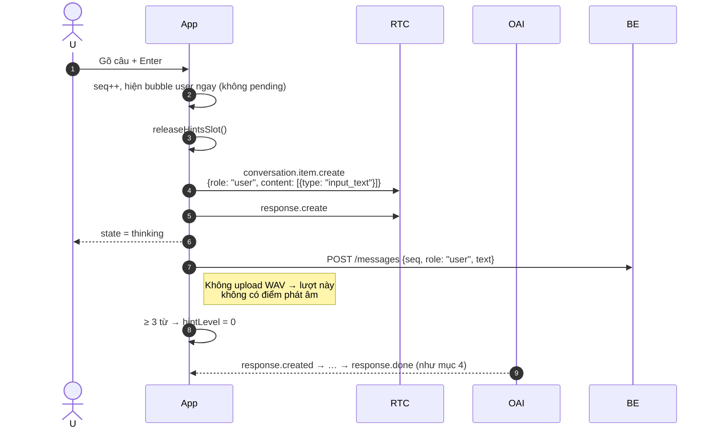
```mermaid
sequenceDiagram
    autonumber
    actor U
    participant App
    participant RTC
    participant OAI
    participant BE

    U->>App: Gõ câu + Enter
    App->>App: seq++, hiện bubble user ngay (không pending)
    App->>App: releaseHintsSlot()
    App->>RTC: conversation.item.create<br/>{role: "user", content: [{type: "input_text"}]}
    App->>RTC: response.create
    App-->>U: state = thinking
    App->>BE: POST /messages {seq, role: "user", text}
    Note right of App: Không upload WAV → lượt này<br/>không có điểm phát âm
    App->>App: ≥ 3 từ → hintLevel = 0
    OAI-->>App: response.created → … → response.done (như mục 4)
```

---

## 8. Hai kênh gợi ý

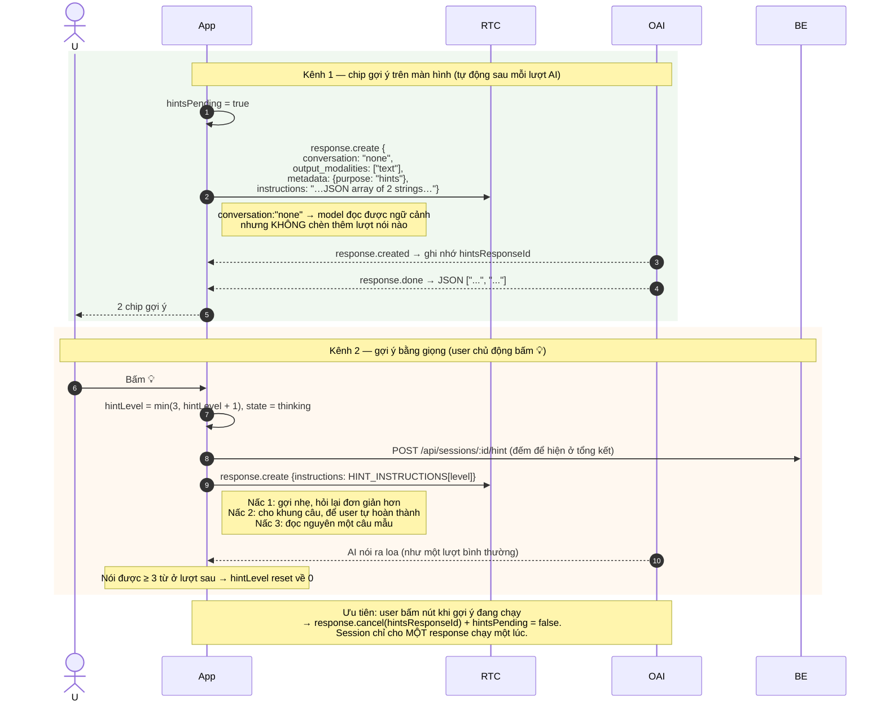
```mermaid
sequenceDiagram
    autonumber
    actor U
    participant App
    participant RTC
    participant OAI
    participant BE

    rect rgb(240, 248, 240)
        Note over App,OAI: Kênh 1 — chip gợi ý trên màn hình (tự động sau mỗi lượt AI)
        App->>App: hintsPending = true
        App->>RTC: response.create {<br/>conversation: "none",<br/>output_modalities: ["text"],<br/>metadata: {purpose: "hints"},<br/>instructions: "…JSON array of 2 strings…"}
        Note right of App: conversation:"none" → model đọc được ngữ cảnh<br/>nhưng KHÔNG chèn thêm lượt nói nào
        OAI-->>App: response.created → ghi nhớ hintsResponseId
        OAI-->>App: response.done → JSON ["...", "..."]
        App-->>U: 2 chip gợi ý
    end

    rect rgb(255, 248, 240)
        Note over U,BE: Kênh 2 — gợi ý bằng giọng (user chủ động bấm 💡)
        U->>App: Bấm 💡
        App->>App: hintLevel = min(3, hintLevel + 1), state = thinking
        App->>BE: POST /api/sessions/:id/hint (đếm để hiện ở tổng kết)
        App->>RTC: response.create {instructions: HINT_INSTRUCTIONS[level]}
        Note right of App: Nấc 1: gợi nhẹ, hỏi lại đơn giản hơn<br/>Nấc 2: cho khung câu, để user tự hoàn thành<br/>Nấc 3: đọc nguyên một câu mẫu
        OAI-->>App: AI nói ra loa (như một lượt bình thường)
        Note over App: Nói được ≥ 3 từ ở lượt sau → hintLevel reset về 0
    end

    Note over App,OAI: Ưu tiên: user bấm nút khi gợi ý đang chạy<br/>→ response.cancel(hintsResponseId) + hintsPending = false.<br/>Session chỉ cho MỘT response chạy một lúc.
```

**Không tin vào `metadata` để nhận ra response gợi ý.** Server **không** trả `metadata` về trong
`response.created` / `response.done`, nên lọc theo metadata là hỏng — gợi ý bị tính thành một lượt AI
thật, sinh ra bubble rỗng. Thứ thật sự dùng được là cờ `hintsPending`: server chỉ chạy một response
một lúc, nên `response.created` đầu tiên sau khi ta gửi yêu cầu gợi ý **chính là nó**.

Đây cũng là con đường duy nhất còn lại để AI chủ động nói: không còn timer im lặng nào tự gọi nó nữa.

---

## 9. Điểm dừng: model đề xuất, client mới chốt

Ba lớp, cố ý không giao hết cho model.

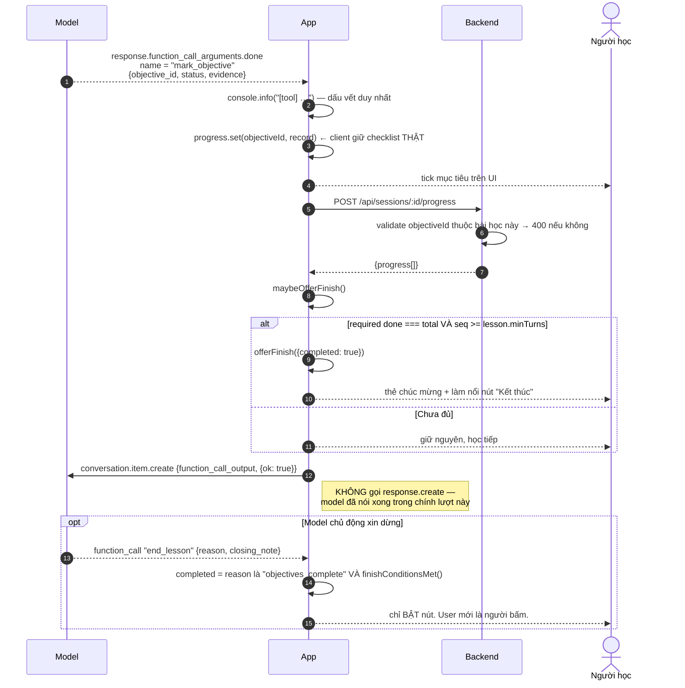
```mermaid
sequenceDiagram
    autonumber
    participant OAI as Model
    participant App
    participant BE as Backend
    actor U as Người học

    OAI-->>App: response.function_call_arguments.done<br/>name = "mark_objective"<br/>{objective_id, status, evidence}
    App->>App: console.info("[tool] …") — dấu vết duy nhất
    App->>App: progress.set(objectiveId, record)  ← client giữ checklist THẬT
    App-->>U: tick mục tiêu trên UI
    App->>BE: POST /api/sessions/:id/progress
    BE->>BE: validate objectiveId thuộc bài học này → 400 nếu không
    BE-->>App: {progress[]}

    App->>App: maybeOfferFinish()
    alt required done === total VÀ seq >= lesson.minTurns
        App->>App: offerFinish({completed: true})
        App-->>U: thẻ chúc mừng + làm nổi nút "Kết thúc"
    else Chưa đủ
        App-->>U: giữ nguyên, học tiếp
    end

    App->>OAI: conversation.item.create {function_call_output, {ok: true}}
    Note right of App: KHÔNG gọi response.create —<br/>model đã nói xong trong chính lượt này

    opt Model chủ động xin dừng
        OAI-->>App: function_call "end_lesson" {reason, closing_note}
        App->>App: completed = reason là "objectives_complete" VÀ finishConditionsMet()
        App-->>U: chỉ BẬT nút. User mới là người bấm.
    end
```

**Chúc mừng hoàn thành — ba ràng buộc, mỗi cái chặn một kiểu hiển thị sai:**

| Ràng buộc | Chặn gì |
|---|---|
| Chỉ `reason === "objectives_complete"` | Chúc mừng người vừa xin dừng vì đuối (`learner_struggling`) |
| `end_lesson` vẫn phải qua `finishConditionsMet()` | Model quên gọi `mark_objective` → thẻ ghi "hoàn thành" ngay trên dòng "Đủ 2/3 mục tiêu" |
| Chốt `congratulated`, cả buổi một lần | `maybeOfferFinish()` chạy sau **mỗi** `mark_objective` nên nó bắn lại ở mọi lượt sau đó |

Thẻ **không tự tắt** — nó là lời mời bấm nút chứ không phải thông báo thoáng qua — và **không chặn
màn hình**, vì lúc nó bật thì AI vẫn đang nói nốt câu của nó. Đóng thẻ rồi học tiếp thì nút "Kết thúc
bài học" vẫn được làm nổi (class `urging`).

**`end_lesson` không chạm server và không ghi DB**, nên dòng `console.info('[tool] …')` là dấu vết
duy nhất cho thấy model đã gọi nó.

---

## 10. Reconnect (rất quan trọng với mobile)

Web mất mạng là chuyện hiếm. Mobile thì đi thang máy, chuyển Wi-Fi ↔ 4G, tàu điện ngầm — luồng này
sẽ chạy thường xuyên hơn nhiều.

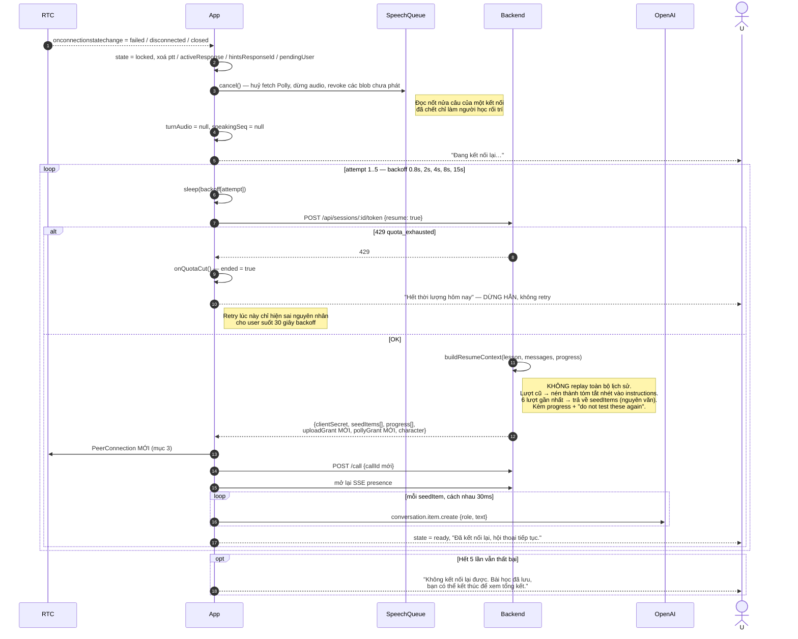
```mermaid
sequenceDiagram
    autonumber
    participant RTC
    participant App
    participant TTS as SpeechQueue
    participant BE as Backend
    participant OAI as OpenAI
    actor U

    RTC-->>App: onconnectionstatechange = failed / disconnected / closed
    App->>App: state = locked, xoá ptt / activeResponse / hintsResponseId / pendingUser
    App->>TTS: cancel() — huỷ fetch Polly, dừng audio, revoke các blob chưa phát
    Note right of TTS: Đọc nốt nửa câu của một kết nối<br/>đã chết chỉ làm người học rối trí
    App->>App: turnAudio = null, speakingSeq = null
    App-->>U: "Đang kết nối lại…"

    loop attempt 1..5 — backoff 0.8s, 2s, 4s, 8s, 15s
        App->>App: sleep(backoff[attempt])
        App->>BE: POST /api/sessions/:id/token {resume: true}

        alt 429 quota_exhausted
            BE-->>App: 429
            App->>App: onQuotaCut() — ended = true
            App-->>U: "Hết thời lượng hôm nay" — DỪNG HẲN, không retry
            Note right of App: Retry lúc này chỉ hiện sai nguyên nhân<br/>cho user suốt 30 giây backoff
        else OK
            BE->>BE: buildResumeContext(lesson, messages, progress)
            Note right of BE: KHÔNG replay toàn bộ lịch sử.<br/>Lượt cũ → nén thành tóm tắt nhét vào instructions.<br/>6 lượt gần nhất → trả về seedItems (nguyên văn).<br/>Kèm progress + "do not test these again".
            BE-->>App: {clientSecret, seedItems[], progress[],<br/>uploadGrant MỚI, pollyGrant MỚI, character}
            App->>RTC: PeerConnection MỚI (mục 3)
            App->>BE: POST /call {callId mới}
            App->>BE: mở lại SSE presence
            loop mỗi seedItem, cách nhau 30ms
                App->>OAI: conversation.item.create {role, text}
            end
            App-->>U: state = ready, "Đã kết nối lại, hội thoại tiếp tục."
        end
    end

    opt Hết 5 lần vẫn thất bại
        App-->>U: "Không kết nối lại được. Bài học đã lưu,<br/>bạn có thể kết thúc để xem tổng kết."
    end
```

> **Audio của message cũ không nạp lại được vào session realtime mới — chỉ nạp text.**
> Không sao: đoạn ghi của người học vẫn nằm nguyên trong DB, còn câu của AI thì đọc lại được từ text
> bất cứ lúc nào.

Reconnect đi qua đúng `#connect()` như lần đầu, nên nó cũng là dịp **cấp lại `uploadGrant` và
`pollyGrant`** — grant hết hạn giữa buổi tự lành theo. Instructions cho lần resume có một khối riêng:
*"Do NOT greet the learner again. Do NOT restart the scenario. Do NOT apologise for the
disconnection."*

---

## 11. Kết thúc + chấm điểm

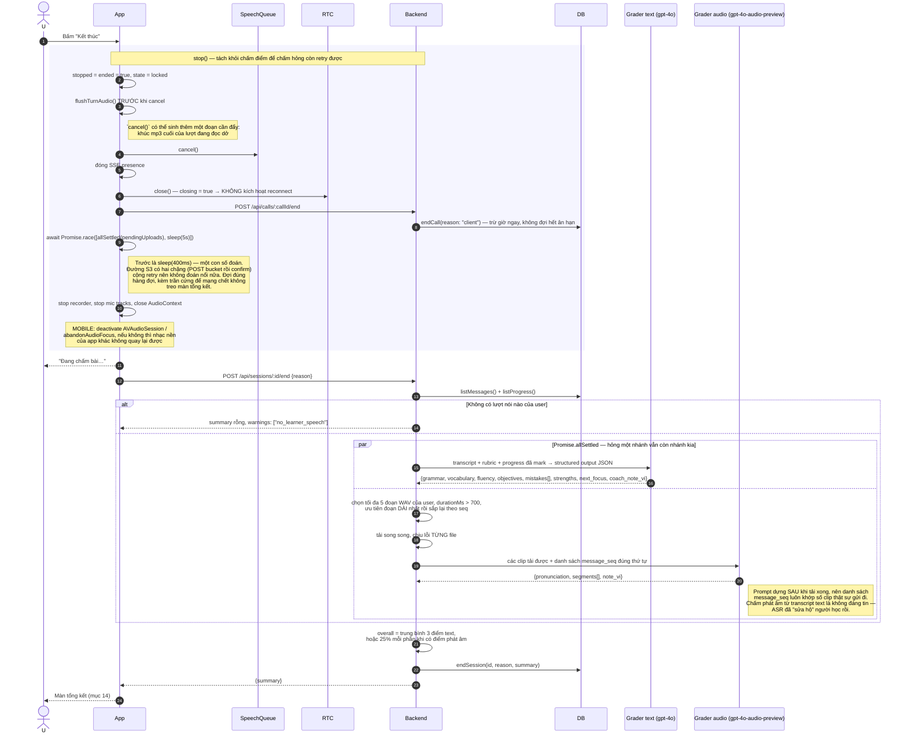
```mermaid
sequenceDiagram
    autonumber
    actor U
    participant App
    participant TTS as SpeechQueue
    participant RTC
    participant BE as Backend
    participant DB
    participant GT as Grader text (gpt-4o)
    participant GA as Grader audio (gpt-4o-audio-preview)

    U->>App: Bấm "Kết thúc"

    rect rgb(245, 245, 255)
        Note over App,BE: stop() — tách khỏi chấm điểm để chấm hỏng còn retry được
        App->>App: stopped = ended = true, state = locked
        App->>App: flushTurnAudio() TRƯỚC khi cancel
        Note right of App: `cancel()` có thể sinh thêm một đoạn cần đẩy:<br/>khúc mp3 cuối của lượt đang đọc dở
        App->>TTS: cancel()
        App->>App: đóng SSE presence
        App->>RTC: close() — closing = true → KHÔNG kích hoạt reconnect
        App->>BE: POST /api/calls/:callId/end
        BE->>DB: endCall(reason: "client") — trừ giờ ngay, không đợi hết ân hạn
        App->>App: await Promise.race([allSettled(pendingUploads), sleep(5s)])
        Note right of App: Trước là sleep(400ms) — một con số đoán.<br/>Đường S3 có hai chặng (POST bucket rồi confirm)<br/>cộng retry nên không đoán nổi nữa. Đợi đúng<br/>hàng đợi, kèm trần cứng để mạng chết không<br/>treo màn tổng kết.
        App->>App: stop recorder, stop mic tracks, close AudioContext
        Note over App: MOBILE: deactivate AVAudioSession /<br/>abandonAudioFocus, nếu không thì nhạc nền<br/>của app khác không quay lại được
    end

    App-->>U: "Đang chấm bài…"
    App->>BE: POST /api/sessions/:id/end {reason}
    BE->>DB: listMessages() + listProgress()

    alt Không có lượt nói nào của user
        BE-->>App: summary rỗng, warnings: ["no_learner_speech"]
    else
        par Promise.allSettled — hỏng một nhánh vẫn còn nhánh kia
            BE->>GT: transcript + rubric + progress đã mark → structured output JSON
            GT-->>BE: {grammar, vocabulary, fluency, objectives, mistakes[], strengths, next_focus, coach_note_vi}
        and
            BE->>BE: chọn tối đa 5 đoạn WAV của user, durationMs > 700,<br/>ưu tiên đoạn DÀI nhất rồi sắp lại theo seq
            BE->>BE: tải song song, chịu lỗi TỪNG file
            BE->>GA: các clip tải được + danh sách message_seq đúng thứ tự
            GA-->>BE: {pronunciation, segments[], note_vi}
            Note right of GA: Prompt dựng SAU khi tải xong, nên danh sách<br/>message_seq luôn khớp số clip thật sự gửi đi.<br/>Chấm phát âm từ transcript text là không đáng tin —<br/>ASR đã "sửa hộ" người học rồi.
        end
    end

    BE->>BE: overall = trung bình 3 điểm text,<br/>hoặc 25% mỗi phần khi có điểm phát âm
    BE->>DB: endSession(id, reason, summary)
    BE-->>App: {summary}
    App-->>U: Màn tổng kết (mục 14)
```

**Ba điều dễ vấp:**

- **Chấm phát âm mặc định TẮT.** `gradeAudio` trả `null` ngay nếu không có `GRADER_AUDIO_MODEL`. Khi
  đó `pronunciation = null` và `overall` chỉ là trung bình ba điểm text — không có `warnings` nào,
  vì đó không phải lỗi.
- Nhánh text hỏng thì **ném lỗi** (không có summary), nhánh audio hỏng thì chỉ thêm
  `warnings: ["pronunciation_grading_failed"]`.
- Nút "Kết thúc" bấm lại được: `active` được giữ nguyên khi chấm hỏng, vì buổi học đã lưu rồi, chỉ
  riêng bước chấm điểm hỏng. Còn "Thoát" (`btn-quit`) thì chỉ `stop()` — thoát giữa chừng không nên
  tốn một lượt gọi model.

---

## 12. Cưỡng chế hạn mức — 3 lớp độc lập

Hỏng một lớp vẫn còn hai lớp kia. **Lớp 3 phải CẮT chứ không được chỉ "ngừng đếm"**: kênh presence và
cuộc gọi WebRTC là hai kết nối độc lập — nếu mất presence chỉ làm đồng hồ dừng lại thì một app sửa
vài dòng có thể đóng presence mà vẫn giữ WebRTC chạy, thành ra gọi miễn phí vô hạn. Trên mobile
chuyện này còn dễ hơn web (app đã ở trên máy người dùng). Không tin, mà cắt.

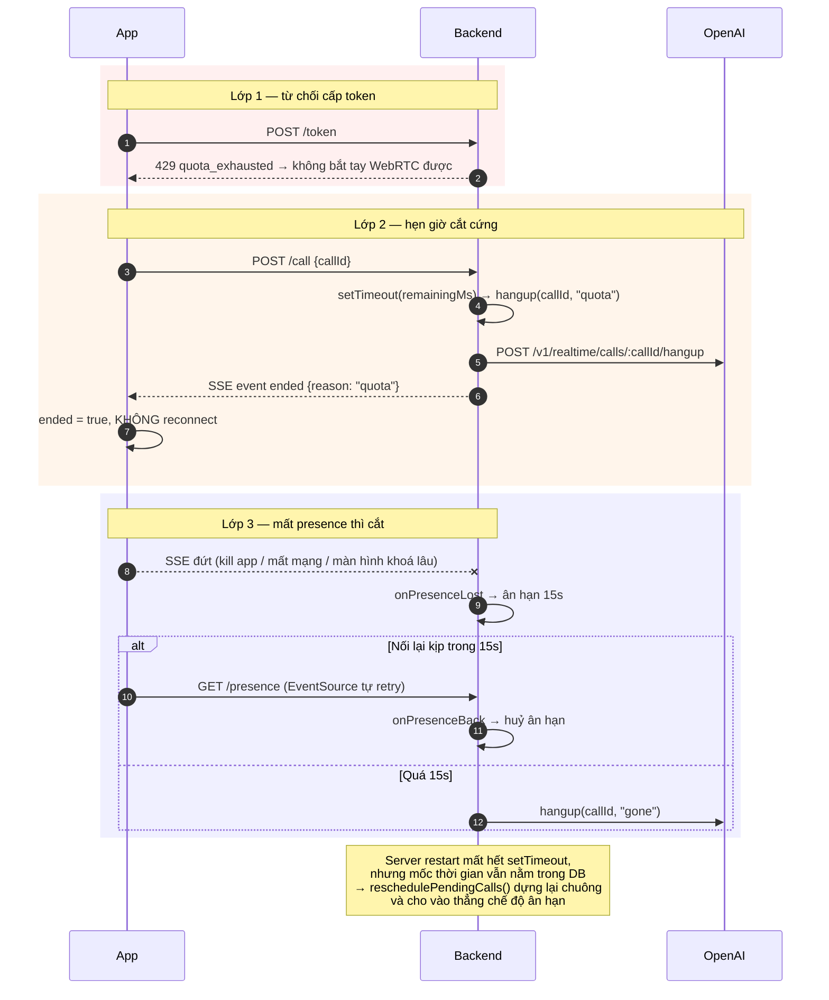
```mermaid
sequenceDiagram
    autonumber
    participant App
    participant BE as Backend
    participant OAI as OpenAI

    rect rgb(255, 240, 240)
        Note over App,BE: Lớp 1 — từ chối cấp token
        App->>BE: POST /token
        BE-->>App: 429 quota_exhausted → không bắt tay WebRTC được
    end

    rect rgb(255, 245, 235)
        Note over App,OAI: Lớp 2 — hẹn giờ cắt cứng
        App->>BE: POST /call {callId}
        BE->>BE: setTimeout(remainingMs) → hangup(callId, "quota")
        BE->>OAI: POST /v1/realtime/calls/:callId/hangup
        BE-->>App: SSE event ended {reason: "quota"}
        App->>App: ended = true, KHÔNG reconnect
    end

    rect rgb(240, 240, 255)
        Note over App,BE: Lớp 3 — mất presence thì cắt
        App--xBE: SSE đứt (kill app / mất mạng / màn hình khoá lâu)
        BE->>BE: onPresenceLost → ân hạn 15s
        alt Nối lại kịp trong 15s
            App->>BE: GET /presence (EventSource tự retry)
            BE->>BE: onPresenceBack → huỷ ân hạn
        else Quá 15s
            BE->>OAI: hangup(callId, "gone")
        end
    end

    Note over BE: Server restart mất hết setTimeout,<br/>nhưng mốc thời gian vẫn nằm trong DB<br/>→ reschedulePendingCalls() dựng lại chuông<br/>và cho vào thẳng chế độ ân hạn
```

**Đơn vị tính giờ là thời gian kết nối thật, không phải số lượt nói.** `usedSince` cộng
`COALESCE(ended_at, now) - started_at` — call chưa đóng vẫn được tính tới thời điểm hỏi, nếu không
thì chỉ cần đóng tab là đồng hồ ngừng chạy.

**Đồng hồ trên màn hình là trang trí.** Client neo lại mốc server gửi rồi **tính lại** mỗi tick thay
vì trừ dần: tab chạy nền bị bóp `setInterval` xuống 1 lần/phút và máy ngủ thì nó dừng hẳn — trừ dần
sẽ chậm theo, còn tính từ mốc neo thì tick trễ bao nhiêu cũng đúng. Tab quay lại foreground thì xin
`GET /api/quota` nắn ngay.

**Định danh:** chưa có đăng nhập — mỗi thiết bị một `randomUUID` trong cookie `did` (httpOnly,
1 năm). Xoá cookie là có hạn mức mới; đó là giới hạn cố hữu của cách này, không phải lỗi.

---

## 13. Lưu trữ audio: client tự đẩy thẳng lên S3

`AUDIO_STORE=disk` (mặc định) giữ luồng cũ: audio đi xuyên qua backend rồi nằm ở `data/audio/`. Phần
dưới mô tả `AUDIO_STORE=s3`.

Nguyên tắc: **cấp quyền ghi một lần cho cả buổi, không ký lại từng file.** Presigned PUT ký gắn chết
vào một key cụ thể nên mỗi lượt nói phải hỏi server xin URL mới — thêm một round-trip ngay trên đường
nóng sau mỗi câu, và URL ngắn hạn thì background upload task của mobile gần như không kịp dùng.
Presigned POST ký theo **điều kiện** (`starts-with $key`) nên một chữ ký phủ hết buổi.

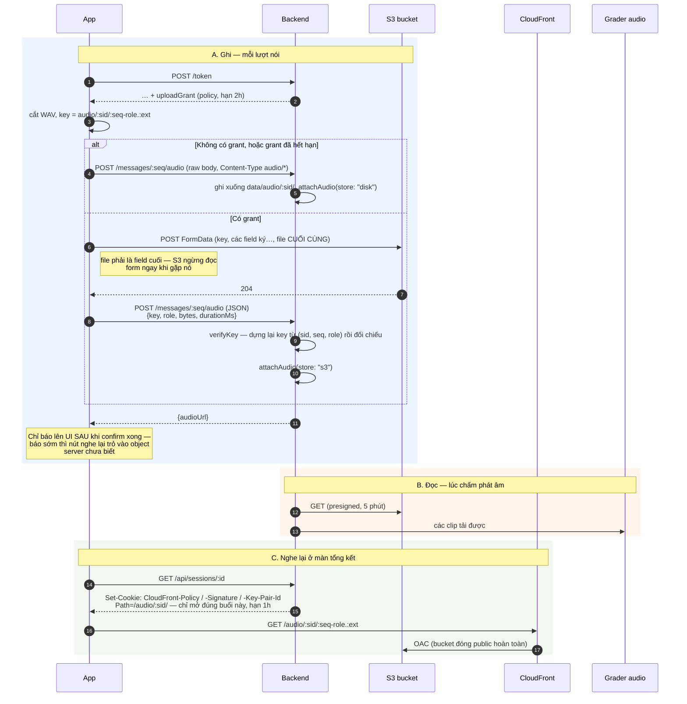
```mermaid
sequenceDiagram
    autonumber
    participant App
    participant BE as Backend
    participant S3 as S3 bucket
    participant CDN as CloudFront
    participant GA as Grader audio

    rect rgb(235, 244, 255)
        Note over App,S3: A. Ghi — mỗi lượt nói
        App->>BE: POST /token
        BE-->>App: … + uploadGrant (policy, hạn 2h)
        App->>App: cắt WAV, key = audio/:sid/:seq-role.:ext
        alt Không có grant, hoặc grant đã hết hạn
            App->>BE: POST /messages/:seq/audio (raw body, Content-Type audio/*)
            BE->>BE: ghi xuống data/audio/:sid/, attachAudio(store: "disk")
        else Có grant
            App->>S3: POST FormData (key, các field ký…, file CUỐI CÙNG)
            Note right of App: file phải là field cuối — S3 ngừng đọc<br/>form ngay khi gặp nó
            S3-->>App: 204
            App->>BE: POST /messages/:seq/audio (JSON)<br/>{key, role, bytes, durationMs}
            BE->>BE: verifyKey — dựng lại key từ (sid, seq, role) rồi đối chiếu
            BE->>BE: attachAudio(store: "s3")
        end
        BE-->>App: {audioUrl}
        Note over App: Chỉ báo lên UI SAU khi confirm xong —<br/>báo sớm thì nút nghe lại trỏ vào object<br/>server chưa biết
    end

    rect rgb(255, 245, 235)
        Note over BE,GA: B. Đọc — lúc chấm phát âm
        BE->>S3: GET (presigned, 5 phút)
        BE->>GA: các clip tải được
    end

    rect rgb(240, 248, 240)
        Note over App,CDN: C. Nghe lại ở màn tổng kết
        App->>BE: GET /api/sessions/:id
        BE-->>App: Set-Cookie: CloudFront-Policy / -Signature / -Key-Pair-Id<br/>Path=/audio/:sid/ — chỉ mở đúng buổi này, hạn 1h
        App->>CDN: GET /audio/:sid/:seq-role.:ext
        CDN->>S3: OAC (bucket đóng public hoàn toàn)
    end
```

**Hai lớp chặn khi ghi, cố ý không tin client:**

| Lớp | Ở đâu | Chặn gì |
|---|---|---|
| Policy | S3 kiểm | Ghi ra ngoài `audio/<sessionId>/`, file < 45B hoặc > 5MB, `Content-Type` không bắt đầu bằng `audio/` |
| `verifyKey` | `audio-store.ts` | Gán file vào nhầm `seq` / `role` trong chính session của mình |

**Đuôi file theo vai, không phải theo lựa chọn:** `<seq>-user.wav` là đoạn cắt từ ring buffer PCM,
`<seq>-assistant.mp3` là file Polly trả về nguyên xi. Giải mã rồi mã hoá lại thành WAV chỉ để đồng
đuôi thì vừa tốn CPU vừa làm file to lên nhiều lần. Vì vậy policy ký `starts-with $Content-Type` là
`audio/` chứ không đối chiếu tuyệt đối — một chữ ký vẫn phải phủ cả hai định dạng, và `putAudioToS3`
lấy `blob.type` thật thay cho giá trị trong `fields`.

**Đường `assistant` mặc định tắt.** Không bật công tắc "Lưu giọng AI" thì không có file nào của AI
cả. Khi bật, một lượt AI bị cắt thành nhiều khúc nhưng chỉ ứng với **một** message, nên các khúc mp3
được gom lại rồi nối thẳng byte — mp3 là dòng frame liên tiếp nên nối byte là phát được, không phải
giải mã rồi mã hoá lại.

**Ba chuyện phải chấp nhận:**

- Server không gọi `HeadObject` để kiểm tra object có thật hay không — thêm một round-trip cho mỗi
  message chỉ để biết trước điều mà grader tự xử lý được. Đổi lại, một message có thể mang
  `audio_path` trỏ vào object không tồn tại; khâu chấm điểm bỏ qua nó và ghi log.
- `audio_store` ghi theo **từng message** chứ không theo cả hệ thống, nên bật S3 giữa chừng thì các
  buổi cũ trên đĩa vẫn nghe lại được.
- Nếu sau này đổi sang R2: R2 hỗ trợ presigned PUT tốt nhưng POST policy thì hạn chế hơn — lúc đó
  phải quay lại kiểu ký từng file.

---

## 14. Màn tổng kết và nghe lại

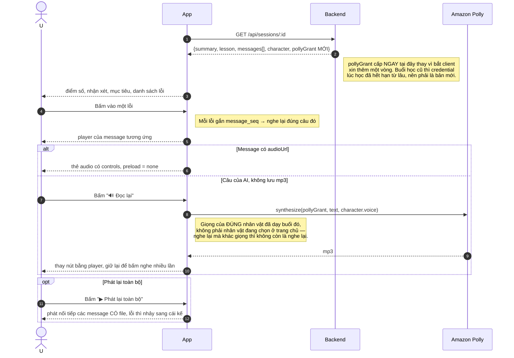
```mermaid
sequenceDiagram
    autonumber
    actor U
    participant App
    participant BE as Backend
    participant P as Amazon Polly

    App->>BE: GET /api/sessions/:id
    BE-->>App: {summary, lesson, messages[], character, pollyGrant MỚI}
    Note right of BE: pollyGrant cấp NGAY tại đây thay vì bắt client<br/>xin thêm một vòng. Buổi học cũ thì credential<br/>lúc học đã hết hạn từ lâu, nên phải là bản mới.

    App-->>U: điểm số, nhận xét, mục tiêu, danh sách lỗi

    U->>App: Bấm vào một lỗi
    Note right of App: Mỗi lỗi gắn message_seq → nghe lại đúng câu đó
    App-->>U: player của message tương ứng

    alt Message có audioUrl
        App-->>U: thẻ audio có controls, preload = none
    else Câu của AI, không lưu mp3
        U->>App: Bấm "🔊 Đọc lại"
        App->>P: synthesize(pollyGrant, text, character.voice)
        Note right of App: Giọng của ĐÚNG nhân vật đã dạy buổi đó,<br/>không phải nhân vật đang chọn ở trang chủ —<br/>nghe lại mà khác giọng thì không còn là nghe lại.
        P-->>App: mp3
        App-->>U: thay nút bằng player, giữ lại để bấm nghe nhiều lần
    end

    opt Phát lại toàn bộ
        U->>App: Bấm "▶ Phát lại toàn bộ"
        App-->>U: phát nối tiếp các message CÓ file, lỗi thì nhảy sang cái kế
    end
```

---

## 15. Vòng đời riêng của mobile app

Ba tình huống web không có. Đây là phần **phải viết thêm** khi port sang mobile.

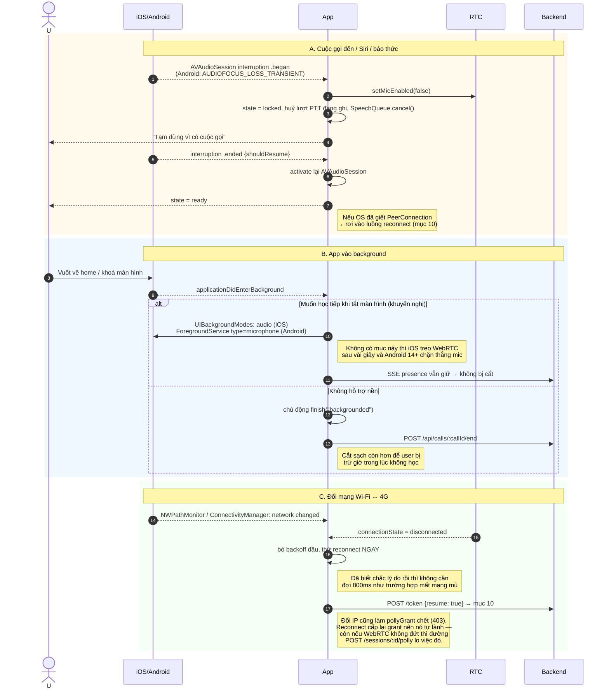
```mermaid
sequenceDiagram
    autonumber
    actor U
    participant OS as iOS/Android
    participant App
    participant RTC
    participant BE as Backend

    rect rgb(255, 250, 235)
        Note over OS,BE: A. Cuộc gọi đến / Siri / báo thức
        OS-->>App: AVAudioSession interruption .began<br/>(Android: AUDIOFOCUS_LOSS_TRANSIENT)
        App->>RTC: setMicEnabled(false)
        App->>App: state = locked, huỷ lượt PTT đang ghi, SpeechQueue.cancel()
        App-->>U: "Tạm dừng vì có cuộc gọi"
        OS-->>App: interruption .ended {shouldResume}
        App->>App: activate lại AVAudioSession
        App-->>U: state = ready
        Note right of App: Nếu OS đã giết PeerConnection<br/>→ rơi vào luồng reconnect (mục 10)
    end

    rect rgb(240, 248, 255)
        Note over OS,BE: B. App vào background
        U->>OS: Vuốt về home / khoá màn hình
        OS-->>App: applicationDidEnterBackground
        alt Muốn học tiếp khi tắt màn hình (khuyến nghị)
            App->>OS: UIBackgroundModes: audio (iOS)<br/>ForegroundService type=microphone (Android)
            Note right of App: Không có mục này thì iOS treo WebRTC<br/>sau vài giây và Android 14+ chặn thẳng mic
            App->>BE: SSE presence vẫn giữ → không bị cắt
        else Không hỗ trợ nền
            App->>App: chủ động finish("backgrounded")
            App->>BE: POST /api/calls/:callId/end
            Note right of App: Cắt sạch còn hơn để user bị<br/>trừ giờ trong lúc không học
        end
    end

    rect rgb(245, 255, 245)
        Note over OS,BE: C. Đổi mạng Wi-Fi ↔ 4G
        OS-->>App: NWPathMonitor / ConnectivityManager: network changed
        RTC-->>App: connectionState = disconnected
        App->>App: bỏ backoff đầu, thử reconnect NGAY
        Note right of App: Đã biết chắc lý do rồi thì không cần<br/>đợi 800ms như trường hợp mất mạng mù
        App->>BE: POST /token {resume: true} → mục 10
        Note right of App: Đổi IP cũng làm pollyGrant chết (403).<br/>Reconnect cấp lại grant nên nó tự lành —<br/>còn nếu WebRTC không đứt thì đường<br/>POST /sessions/:id/polly lo việc đó.
    end
```

---

## 16. Khác biệt web ↔ mobile

Backend **không cần đổi gì** ngoài ba chỗ được đánh dấu ⚠️.

| Việc | Web (hiện tại) | Mobile app |
|---|---|---|
| Định danh thiết bị | ⚠️ Cookie `did` (httpOnly) | Cookie không tự nhiên trên native → gửi `X-Device-Id` lấy từ Keychain/Keystore. Backend đã nhận diện header này (`isNativeClient`) để ký URL, nhưng `deviceId()` thì **chưa** đọc nó |
| Kết nối WebRTC | `RTCPeerConnection` của browser | libwebrtc: `RTCPeerConnection` (iOS), `PeerConnection` (Android). API gần như 1-1 |
| Data channel | `dc.send(JSON)` | như nhau — `RTCDataChannel.sendData(RTCDataBuffer)` |
| Phát audio AI | `<audio src=blob:>` (mp3 từ Polly) | `AVAudioPlayer` / `ExoPlayer` trên chính file mp3. Không còn dính đến libwebrtc |
| Ký SigV4 gọi Polly | WebCrypto (`crypto.subtle`) | CryptoKit `HMAC<SHA256>` / `javax.crypto.Mac`. Cùng thuật toán, đồng bộ nên còn gọn hơn |
| Xếp hàng request Polly | Cửa `serial` toàn cục, vì browser gộp cả origin vào **một** kết nối h2 | Kiểm tra lại: nếu HTTP client mở kết nối riêng cho mỗi request thì ràng buộc `MAX_CONCURRENT_STREAMS = 1` không còn áp dụng, và cửa này chỉ còn làm chậm khúc đầu |
| Đổi tốc độ đọc | `audio.playbackRate` + `preservesPitch` | iOS: `AVAudioUnitTimePitch` (đổi rate, giữ pitch). Android: `PlaybackParams.setSpeed` |
| Nhép mồm | `createMediaElementSource` → `AnalyserNode` → RMS | iOS: `AVAudioEngine` tap trên player node. Android: `Visualizer` hoặc tap của ExoPlayer. Cùng ý tưởng: RMS mỗi frame → `FakeMouth.step` |
| Ghi PCM để cắt WAV | 1× `AudioWorklet` (chỉ mic) | iOS: `AVAudioEngine.inputNode` tap. Android: `JavaAudioDeviceModule.setSamplesReadyCallback`. Cùng ý tưởng: ring buffer PCM 16kHz, cắt bằng timestamp |
| Echo cancellation | `getUserMedia {echoCancellation: true}` | Bật AEC cấp OS: `.voiceChat` mode (iOS) / `JavaAudioDeviceModule` builtin AEC+NS (Android). Quan trọng hơn web vì loa ngoài |
| Kênh presence | `EventSource` (tự retry) | Không có `EventSource` native → SSE thủ công (`URLSession.bytes` / OkHttp streaming) **và tự viết vòng retry**, hoặc đổi sang WebSocket. ⚠️ Nếu đổi WS thì backend thêm route |
| Upload audio | `FormData` + `fetch` thẳng lên S3 | `URLSession.uploadTask(fromFile:)` / OkHttp `MultipartBody`, cũng thẳng lên S3. Nên dùng background upload task để đóng app giữa chừng vẫn đẩy nốt — grant sống 2h nên kịp |
| Nghe lại ở tổng kết | `<audio src>` + signed cookie (trình duyệt tự đính kèm) | Native không có cookie jar → backend ký thẳng vào URL khi request mang `X-Device-Id`. Cùng key pair, khác cơ chế |
| Avatar | Spine WebGL, nạp bằng dynamic import | spine-cpp / spine-unity / spine-libgdx trên chính file `.skel` + `.atlas.txt` |
| Quyền micro | Prompt của browser | Xin trước khi vào màn học, có màn giải thích + đường dẫn tới Settings khi bị từ chối vĩnh viễn |
| Vòng đời | Tab đóng là xong | Interruption, background, đổi mạng — xem mục 15 |

### Ba thay đổi backend cần cho mobile

1. **Định danh không phụ thuộc cookie.** `deviceId()` trong `server/index.ts` hiện chỉ đọc cookie
   `did`. Thêm nhánh đọc `X-Device-Id` / bearer token trước khi fallback về cookie. Hạn mức
   (`quotaFor(userId)`) và toàn bộ phần còn lại giữ nguyên.
2. **Static file `/audio/...`** (đường `disk`) vẫn phục vụ không kiểm tra chủ sở hữu. Web thì URL khó
   đoán, nhưng khi mobile phát audio qua player riêng nên chốt luôn: kiểm tra session thuộc về
   `deviceId` của request. Đường `s3` thì không còn vấn đề này — chữ ký ràng theo đúng một session.
3. **`aws:SourceIp` khi có reverse proxy.** `clientIp()` đọc `X-Forwarded-For` trước rồi mới tới
   `socket.remoteAddress`. Nếu triển khai sau một proxy **không** đặt header đó thì mọi thiết bị dùng
   chung một IP nội bộ — `bindableIp()` tự bỏ qua các dải private/loopback, nhưng nếu proxy đưa ra
   một IP public duy nhất thì việc ràng buộc mất tác dụng mà không báo gì. Lúc đó đặt
   `POLLY_STS_BIND_IP=off` cho rõ ràng, hơn là để một lớp bảo vệ chỉ tồn tại trên giấy.

### Có thể dùng lại nguyên xi

Toàn bộ `LessonSession` là logic thuần (state machine PTT, backoff, hint escalation, điểm dừng,
cắt/upload audio) — không đụng DOM. `SentenceChunker`, `FakeMouth`, `waitForPlayback`, `clampSpeed`
cũng vậy, và cả bốn đều đã có test chạy được ngoài trình duyệt. Nếu làm mobile bằng React Native /
Flutter thì port gần như copy; nếu native thì đây là bản đặc tả để viết lại trong Swift/Kotlin.

---

## Phụ lục — bảng tra endpoint

| Method | Path | Dùng ở mục |
|---|---|---|
| GET | `/api/lessons` | 2 |
| GET | `/api/lessons/:id` | — |
| GET | `/api/characters` | 2 |
| GET | `/api/sessions` | 2 |
| POST | `/api/sessions` | 2 — 402 nếu nhân vật trả phí |
| GET | `/api/sessions/:id` | 2, 14 — kèm `pollyGrant` mới + signed cookie |
| POST | `/api/sessions/:id/token` | 3, 10 — **lớp 1** hạn mức |
| POST | `/api/sessions/:id/polly` | 5 — cấp lại riêng quyền Polly |
| POST | `/api/sessions/:id/call` | 3 — **lớp 2** hạn mức |
| GET | `/api/calls/:callId/presence` | 3, 12 — SSE, **lớp 3** hạn mức |
| POST | `/api/calls/:callId/end` | 11 |
| POST | `/api/sessions/:id/messages` | 4, 7 |
| POST | `/api/sessions/:id/messages/:seq/audio` | 13 — JSON (S3) hoặc raw body (disk) |
| POST | `/api/sessions/:id/progress` | 9 |
| POST | `/api/sessions/:id/hint` | 8 |
| POST | `/api/sessions/:id/end` | 11 |
| GET | `/api/quota` | 2, 12 |
| GET | `/audio/...` | 13 — đường `disk` |
| GET | `/character/...` | 6 — asset Spine |
