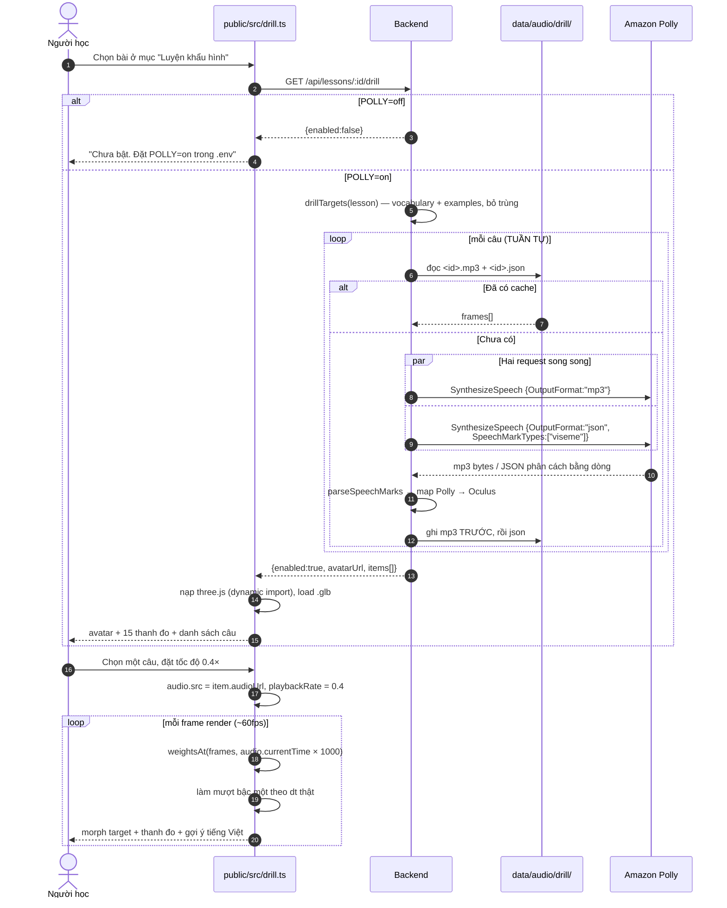

# Luyện khẩu hình — viseme từ Amazon Polly, avatar 3D

Tài liệu này mô tả màn **luyện khẩu hình**: người học chọn một từ hoặc câu mẫu của bài, xem avatar
3D diễn khẩu hình chậm, tua về đúng âm vừa sai, rồi nhại lại.

Các diagram bám sát code hiện tại (`server/polly.ts`, `server/drill.ts`, `shared/viseme.ts`,
`public/src/drill.ts`, `public/src/viseme-player.ts`, `public/src/avatar.ts`).

Luồng này **không đi qua WebRTC và không tốn hạn mức gọi** — nó hoàn toàn nằm ngoài
[`ai-talk-flow.md`](ai-talk-flow.md).

> **Cập nhật 2026-08-16.** Hội thoại giờ **cũng** có khẩu hình: OpenAI chỉ còn trả text, tiếng nói
> do client tự lấy từ Polly nên có luôn viseme. Xem [mục 0](#0-ràng-buộc-gốc-đã-được-gỡ-bằng-cách-nào)
> và [mục 6](#6-những-phương-án-đã-loại). Màn luyện khẩu hình mô tả ở đây **vẫn giữ nguyên**: nó là
> chỗ dừng lại kéo chậm và tua đi tua lại, việc mà giữa hội thoại không ai làm được.

---

## 0. Ràng buộc gốc, đã được gỡ bằng cách nào

Ràng buộc thì vẫn còn nguyên:

> **OpenAI Realtime API không phát ra event viseme hay phoneme nào, và cũng không có timestamp cho
> transcript.** Audio của AI về dưới dạng WebRTC media track thuần.

Nghĩa là chừng nào tiếng nói còn đến từ Realtime API, muốn avatar nhép chỉ còn cách suy viseme từ
phổ âm thanh. Cách đó cho ra chuyển động đúng **nhịp** nhưng sai **âm vị**: phụ âm bật (p, b, d, k)
về bản chất là một khoảng lặng rồi bung ra, gần như không tách được khỏi im lặng bằng phân tích
phổ. Với một app chỉ cần "avatar có mặt cho sinh động" thì đủ. Với app **dạy phát âm** thì nhép sai
là dạy sai.

Cách thoát: **đừng suy từ audio — chọn ngữ cảnh mà text biết trước.**

Ban đầu điều đó chỉ đúng với màn luyện khẩu hình (từ vựng và câu mẫu nằm sẵn trong lesson JSON).
Nhưng nó cũng đúng với chính hội thoại, nếu chấp nhận đổi nguồn tiếng nói: cho Realtime API trả
**text** thay vì audio, rồi để client đọc text đó bằng Polly. Lúc đó câu AI vừa nói cũng là text
biết trước, và viseme lại chính xác theo định nghĩa.

Đó là kiến trúc hiện tại. Hai màn dùng chung đúng một tầng dữ liệu, khác nhau ở chỗ gọi Polly:
màn luyện khẩu hình gọi ở server và cache lại (câu cố định), hội thoại gọi thẳng từ client
(câu sinh ra lúc chạy, và mỗi vòng qua backend là độ trễ người học nghe thấy).

Về mặt sư phạm hai chỗ vẫn khác nhau và vẫn cần cả hai: trong hội thoại AI nói ~150 từ/phút, avatar
chỉ để nhìn cho tự nhiên. Chỗ người học thật sự học khẩu hình vẫn là lúc dừng lại, kéo xuống 0.4×,
tua về đúng âm vừa sai.

---

## 1. Tổng quan



**Vì sao các câu chưa cache được đọc tuần tự chứ không song song:** đây là đường lạnh, chạy đúng
một lần cho mỗi bài. Bắn vài chục request lên Polly cùng lúc chỉ để tiết kiệm vài giây thì dễ ăn
throttle hơn là được gì.

**Một câu hỏng không làm hỏng cả bài** — bỏ câu đó ra khỏi kết quả và ghi log, phần còn lại vẫn học
được.

---

## 2. Ba tầng, tách rời có chủ đích

```
Polly (server)          →  timeline viseme đúng âm vị
  shared/viseme.ts      →  map 17 viseme Polly → 15 viseme Oculus
viseme-player.ts        →  timeline + audio.currentTime → trọng số 0..1
avatar.ts               →  trọng số → morphTargetInfluences
```

`viseme-player.ts` **không biết gì về three.js hay DOM** — nó chỉ trả ra một bảng trọng số. Nhờ vậy
thanh đo debug và avatar 3D dùng chung đúng một nguồn.

> **15 thanh đo viseme luôn hiện cạnh avatar**, kể cả khi không cấu hình `AVATAR_URL`.
> Khi mồm avatar đứng im, đây là cách nhanh nhất để biết lỗi ở tầng nào: thanh đo nhảy mà mồm đứng
> im → lỗi ở model/morph target. Thanh đo cũng đứng im → lỗi ở dữ liệu hoặc timeline.

Ba trường hợp hỏng của avatar được báo **khác nhau**, vì cách sửa khác hẳn nhau:

| Hiện tượng | Nguyên nhân | Sửa |
|---|---|---|
| "Chưa cấu hình AVATAR_URL" | thiếu env | đặt `AVATAR_URL` |
| "Không tải được avatar: …" | URL sai / mạng / CORS | kiểm tra URL |
| "Model tải được nhưng không có morph target viseme nào" | thiếu `?morphTargets=Oculus Visemes` | tải lại `.glb` kèm tham số |

---

## 3. Đồng hồ: bám `audio.currentTime`, không phải wall clock

```mermaid
sequenceDiagram
    autonumber
    participant RAF as requestAnimationFrame
    participant VP as VisemePlayer
    participant A as HTMLAudioElement
    participant Av as Avatar

    loop mỗi frame
        RAF->>VP: tick()
        VP->>A: currentTime
        Note right of A: playbackRate 0.4× → currentTime<br/>chạy chậm lại theo. Kéo thanh tua →<br/>nhảy thẳng tới mốc mới.
        VP->>VP: weightsAt(frames, t)
        Note right of VP: Timeline Polly là các mốc RỜI RẠC.<br/>Một viseme giữ cho tới mốc kế tiếp;<br/>70ms cuối thì chéo dần sang viseme sau.
        VP->>VP: w += (target − w) × (1 − e^(−dt/45ms))
        Note right of VP: Lọc theo dt THẬT, không theo số frame:<br/>máy yếu tụt fps thì tốc độ làm mượt<br/>vẫn y nguyên.
        VP->>Av: apply(weights)
    end
```

Vòng render **chạy cả khi audio đang tạm dừng** — nhờ vậy dừng hình giữa câu vẫn thấy đúng khẩu
hình của mốc đó, đúng thứ người học cần khi đang soi.

**Vì sao có giao thoa 70ms:** miệng thật không nhảy cóc. Khi phát /b/ trong "about", môi đã chụm
lại từ trước đó. Nhảy tức thời giữa các viseme nhìn ra ngay là máy, và với người đang tập bắt chước
thì còn dạy sai cả cách chuyển âm.

**Dòng gợi ý tiếng Việt đọc từ timeline, không đọc từ bảng trọng số đã làm mượt.** Giữa hai khẩu
hình, trọng số bị chia đôi nên không cái nào vượt ngưỡng, và dòng chữ sẽ nháy về "Miệng nghỉ" một
cái — đúng lúc người học đang đọc nó.

---

## 4. Bảng map Polly → Oculus

Polly trả bộ viseme của nó (17 giá trị + `sil`, theo IPA). Avatar Ready Player Me nhận bộ Oculus
OVR LipSync (15 morph target, tên có tiền tố `viseme_`).

| Polly | Âm | → Oculus |
|---|---|---|
| `p` | b, m, p | `PP` |
| `f` | f, v | `FF` |
| `T` | θ, ð | `TH` |
| `t` | d, n, t | `DD` |
| `k` | g, h, k, ŋ | `kk` |
| `S` | ʃ, tʃ, dʒ, ʒ | `CH` |
| `s` | s, z | `SS` |
| `l` | l | `nn` |
| `r` | ɹ | `RR` |
| `a` | æ, ɑ, aɪ, aʊ | `aa` |
| `e` / `E` | eɪ / ɛ, ʌ, ɜ | `E` *(gộp)* |
| `i` | i, ɪ, j | `I` |
| `o` / `O` | oʊ / ɔ, ɔɪ | `O` *(gộp)* |
| `u` | u, ʊ, w | `U` |
| `@` | ə, ɚ | `E` ở trọng số 0.55 |
| `sil` | — | `sil` |

**Hai chỗ gộp (`e`/`E`, `o`/`O`) là giới hạn của rig, không phải của Polly** — Polly phân biệt được,
RPM không có morph target riêng.

**Schwa (`@`) bị hạ trọng số xuống 0.55** vì nó là nguyên âm giảm, miệng chỉ hé ra. Cho nó trọng số
đầy như `E` thì avatar nhai quá mạnh ở các âm tiết không nhấn — nhìn ra ngay là sai.

Bảng map nằm ở `shared/viseme.ts` chứ không ở một trong hai phía, vì cả server lẫn client đều phải
hiểu **cùng** một bộ tên: server ghi ra `PP`, client tra `viseme_PP` trên mesh. Lệch một ký tự là
mồm đứng im mà không báo lỗi.

---

## 5. Cache

Key là `sha256(voiceId | engine | text)` cắt còn 16 ký tự. Đổi giọng hoặc đổi engine là đổi id, nên
cache cũ không bị phát nhầm bằng timeline của giọng khác.

```
data/audio/drill/<id>.mp3     ← phục vụ qua route tĩnh /audio/ có sẵn
data/audio/drill/<id>.json    ← VisemeFrame[]
```

Ghi **mp3 trước, json sau**. Chết giữa chừng thì lần sau `cached()` thấy thiếu json và sinh lại;
ngược lại sẽ trả về một timeline không có tiếng đi kèm.

Cache RAM ở `server/index.ts` giữ cả `Promise` chứ không chỉ kết quả, để hai request đến cùng lúc
lúc chưa có cache không cùng gọi Polly hai lần. Hỏng thì xoá khỏi map để lần sau thử lại, không
ghim lỗi vĩnh viễn.

**Chi phí:** hai bài hiện có cộng lại 527 ký tự → khoảng **$0.017 một lần** (neural, $16 / 1M ký
tự, nhân đôi vì hai request). Free tier neural còn 1 triệu ký tự/tháng.

---

## 6. Những phương án đã loại

| Phương án | Vì sao loại |
|---|---|
| **Suy viseme từ phổ âm thanh** (band energy / formant / `wawa-lipsync`) | Đúng nhịp, sai âm vị. Dạy phát âm bằng nó là dạy sai. `wawa-lipsync` còn đang ở v0.0.2. |
| **G2P từ transcript + forced alignment ngay trong hội thoại** | Realtime API không cho timestamp, nên phải tự align trực tiếp — rất khó và dễ trôi. |
| ~~**Đổi cả đường audio hội thoại sang Polly/Azure TTS**~~ | **Đã đổi ý — đây giờ chính là thiết kế đang chạy.** Xem bên dưới. |
| **Azure Speech thay vì Polly** | Tương đương về mặt tính năng (`visemeReceived` + blendshape stream). Chọn Polly vì repo **đã** ký SigV4 bằng `node:crypto` trong `server/s3.ts` và **đã** có credential AWS trong `.env` — thêm Polly là tái dùng signer sẵn có. Azure là thêm vendor, credential và SDK mới. |
| **Forced alignment hậu kỳ (MFA) cho các câu AI đã nói** | Chính xác và đúng ngữ cảnh bài học, nhưng không live, và MFA cần Python/Kaldi trong một container riêng. Không còn cần tới nữa. |

### Vì sao đổi ý về phương án Polly cho hội thoại

Ba lý do loại nó trước đây, soát lại từng cái:

| Lý do cũ | Còn đúng không |
|---|---|
| "Mất cơ chế ngắt lời tự nhiên của Realtime" | **Sai ngay từ đầu.** App chạy `turn_detection: null` và push-to-talk — không có barge-in nào để mà mất. Đây là chỗ phân tích cũ hỏng, không phải chỗ hoàn cảnh đổi |
| "Thêm 300–800ms trễ mỗi lượt" | **Đúng nhưng đã giảm được.** Cắt khúc đầu ở mệnh đề đầu (15–40 ký tự) rồi tổng hợp khúc sau trong lúc khúc trước đang phát, nên chỉ khúc đầu là người học phải đợi. Client tự ký gọi thẳng Polly nên không có vòng nào qua backend |
| "Mất giọng của Realtime" | **Vẫn đúng, và là cái giá thật.** Polly neural phẳng hơn rõ. Đổi lại: cùng một giọng với màn luyện khẩu hình, và điều khiển được (tốc độ đổi ngay cả giữa câu, SSML nếu cần sau này) |

Cái được mà lúc đó không cân đủ: **bỏ audio output của Realtime cũng xoá luôn mảng phức tạp nhất
của `session.ts`** — vòng dò im lặng 300ms/12s để *đoán* khi nào AI nói xong, `TrackRecorder` cho
remote track, và toàn bộ đường upload WAV của AI. Giờ "AI nói xong" là một sự kiện chắc chắn: hàng
đợi đọc cạn.

Chi tiết ở [`docs/superpowers/specs/2026-08-16-client-side-tts-viseme-design.md`](superpowers/specs/2026-08-16-client-side-tts-viseme-design.md).

---

## 7. Giới hạn đã biết

**Rig không có lưỡi.** Với người Việt học tiếng Anh, những phân biệt khó nhất lại nằm ở lưỡi:
θ/ð (lưỡi giữa hai răng), l vs n, âm r. Avatar RPM không có lưỡi; morph target gần như chỉ có môi
và hàm, nên `TH` chỉ ra được một xấp xỉ môi/hàm. **Polly cho dữ liệu đúng nhưng rig không diễn ra
được.**

Bù tạm bằng `VISEME_HINT_VI` trong `shared/viseme.ts`: mỗi khẩu hình kèm một dòng tiếng Việt nói
thẳng vị trí lưỡi, ví dụ `TH: Dau luoi tho ra GIUA HAI RANG — cho de luoi sau rang`. Đây là bù đắp,
không phải giải pháp. Muốn giải thật thì đổi sang model có morph lưỡi (hoặc thêm sơ đồ cắt dọc
khoang miệng bên cạnh avatar) — và việc đó **không đụng tới tầng dữ liệu**, vì bảng trọng số vẫn y
nguyên.

**Chưa gọi Polly thật.** Định dạng `Authorization` đã được AWS chấp nhận — lỗi trả về với credential
giả là `UnrecognizedClientException` chứ không phải `SignatureDoesNotMatch`, nghĩa là header đọc
được và chỉ không tìm thấy access key. Nhưng điều đó **không** chứng minh phép tính chữ ký đúng.
Cần một lần chạy với credential thật, giống hệt lý do vì sao có `npm run test:s3`.

Từ khi hội thoại cũng dùng Polly, chỗ này gánh nặng hơn hẳn: chữ ký sai thì hỏng **cả hai** màn,
không riêng màn luyện khẩu hình.

**Chưa gọi Polly từ browser lần nào.** Đường hội thoại ký SigV4 bằng WebCrypto rồi `fetch` thẳng
tới `polly.<region>.amazonaws.com`. Request mang `authorization` + `x-amz-date` +
`x-amz-security-token` nên chắc chắn kích hoạt preflight `OPTIONS`. AWS có tutorial gọi Polly thẳng
từ browser bằng Cognito nên nhiều khả năng là được, nhưng **chưa ai chạy thử ở đây**, và đã quyết
định không làm đường lùi qua backend. CORS không qua là AI câm.

**`crypto.subtle` chỉ có trong secure context.** `http://localhost` có, `http://192.168.x.x` thì
không — mở trên điện thoại cùng mạng LAN sẽ thấy `crypto.subtle` là `undefined` chứ không phải lỗi
chữ ký. Phải có https hoặc tunnel.

**Chưa render avatar 3D lần nào.** Ba nhánh hỏng ở mục 2 đều có mã xử lý, nhưng chưa ai nhìn thấy
nó chạy.
