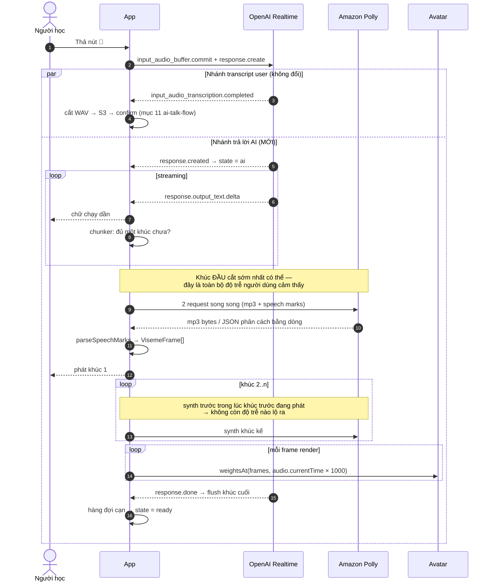

# Đổi đường audio của AI sang Polly phía client

**Ngày:** 2026-08-16
**Trạng thái:** thiết kế, chờ duyệt

## 1. Vấn đề

Hôm nay AI nói bằng audio của OpenAI Realtime API. Đường đó không cho viseme, không cho
phoneme, không cho timestamp — nên avatar không nhép được trong lúc hội thoại, và
[`lip-sync.md`](../../lip-sync.md) mục 0 đã phải tách hẳn phần luyện khẩu hình ra một màn riêng.

`lip-sync.md` mục 6 từng loại phương án "đổi cả đường audio hội thoại sang Polly" với ba lý do:
mất giọng Realtime, mất cơ chế ngắt lời tự nhiên, thêm 300–800ms trễ mỗi lượt.

**Lý do thứ hai không còn đúng.** App đã chạy `turn_detection: null` và push-to-talk
([`ai-talk-flow.md`](../../ai-talk-flow.md) mục 3) — không có barge-in nào để mà mất. Điều đó
làm đổi hẳn cán cân.

## 2. Kiến trúc mới

OpenAI chỉ còn nghe audio và trả **text**. Client tự gom text thành câu, tự ký và gọi thẳng
Amazon Polly để lấy mp3 + viseme timeline, tự phát. Backend chỉ cấp chữ ký.

```
OAI text delta ──> chunker ──> hàng đợi ──> Polly ──> <audio> ──> VisemePlayer ──> avatar
                  (cắt câu)   (synth trước)  (client ký)  playbackRate
```

Nguyên tắc kiến trúc hiện có vẫn giữ nguyên và còn được củng cố: **backend không nằm trên
đường audio.** Nay đúng cho cả TTS, không chỉ cho media Realtime và lưu trữ S3.

### Một lượt AI



### Cái được

| Được | Chi tiết |
|---|---|
| Viseme đúng âm vị trong hội thoại | Thứ `lip-sync.md` mục 0 tuyên bố bất khả thi |
| Biết chính xác khi nào AI nói xong | Hàng đợi cạn, thay cho vòng dò im lặng 300ms/12s đang **đoán** |
| Đổi tốc độ tức thì, kể cả giữa câu | `playbackRate` thay cho `session.update` chỉ đổi được giữa các lượt |
| Rẻ hơn | Bỏ audio output token của Realtime; Polly neural $16/1M ký tự |
| Bớt lưu trữ | Không upload WAV của AI lên S3 nữa (mặc định) |

### Cái mất, chấp nhận có ý thức

- **Prosody của giọng Realtime.** Polly neural phẳng hơn rõ. Đổi lại được sự nhất quán với
  màn luyện khẩu hình (cùng một giọng) và điều khiển được bằng SSML về sau.
- **Gấp đôi request Polly.** mp3 và speech marks là hai lần gọi, không gộp được
  (`server/polly.ts:194` đã ghi rõ). Chạy song song nên không tốn latency, chỉ tốn tiền và TPS.

## 3. Cắt câu — chỗ quyết định độ trễ

Toàn bộ độ trễ người dùng cảm thấy nằm ở **khúc đầu tiên**. Từ khúc thứ hai trở đi, việc
tổng hợp diễn ra trong lúc khúc trước đang phát nên không lộ ra.

Nên luật cắt **bất đối xứng**:

| | Ngưỡng |
|---|---|
| Khúc đầu | Cắt ở dấu kết câu, hoặc dấu `,;:—`, hoặc ranh giới từ khi quá 40 ký tự — cái nào tới trước. Tối thiểu 15 ký tự |
| Khúc sau | Gom tới hết câu và ≥ 60 ký tự. Trần cứng 200 ký tự thì cắt ở dấu mềm gần nhất, không có thì ranh giới từ |
| `response.done` | Flush phần còn lại bất kể dài ngắn |

Không được cắt nhầm ở: `Mr. Mrs. Ms. Dr. Prof. St. Jr. Sr. vs. etc. e.g. i.e. a.m. p.m.` và số
thập phân (`3.14`). Cắt bậy giữa câu thì Polly đọc sai ngữ điệu nghe ra ngay.

Trần 200 ký tự nằm rất xa giới hạn 3000 ký tự mỗi request của Polly, nên không phải lo.

**Vị trí:** `shared/chunk.ts` — hàm thuần, không đụng DOM, test bằng `node:test` giống
`shared/speed.ts` và `shared/viseme.ts`. Đây là phần dễ sai nhất trong cả thay đổi này và cũng
là phần dễ test nhất.

## 4. Phát bằng cặp `<audio>`, không dùng Web Audio

Quyết định này có một lý do cụ thể, không phải chọn cho tiện:

> `<audio>.playbackRate` có `preservesPitch` nên chậm 0.5× vẫn đúng cao độ.
> `AudioBufferSourceNode.playbackRate` là resample thuần — chậm lại là tụt giọng thành giọng vịt.

Với app dạy phát âm, nghe chậm mà sai cao độ là dạy sai. Đây cũng chính là lý do màn luyện
khẩu hình hiện tại đang dùng `<audio>` + `playbackRate`.

Giá phải trả: khe hở ~20–40ms khi đổi `src` giữa hai khúc. Dùng **hai `<audio>` luân phiên**
(preload khúc kế trong lúc khúc này đang phát) để khe đó nhỏ nhất, và vì mọi điểm cắt đều là
dấu câu nên khe rơi đúng vào chỗ đằng nào cũng phải nghỉ.

`VisemePlayer` **không phải sửa gì** — nó đã bám `audio.currentTime` (`viseme-player.ts:123`)
nên `playbackRate` đổi là timeline tự giãn theo. Chỉ cần trỏ nó vào `<audio>` đang hoạt động
và gọi `load(frames)` mỗi khi sang khúc mới.

## 5. Quyền gọi Polly từ browser

### 5.1 Cấp một lần cho cả buổi

`POST /api/sessions/:id/token` trả thêm `pollyGrant`. Ký **một lần**, `DurationSeconds=3600`
(trần mặc định của IAM role) — dài hơn mọi buổi học, nên cả buổi một chữ ký. Reconnect gọi lại
`/token` nên tự có bản mới, không cần đường riêng.

```ts
interface PollyGrant {
  region: string;
  accessKeyId: string;
  secretAccessKey: string;
  sessionToken: string;
  expiresAt: number;   // epoch ms
  voiceId: string;     // mặc định, người học đổi được
  engine: PollyEngine;
}
```

### 5.2 Session policy — ràng vào IP và thời gian

```json
{ "Version": "2012-10-17",
  "Statement": [{
    "Effect": "Allow",
    "Action": "polly:SynthesizeSpeech",
    "Resource": "*",
    "Condition": {
      "IpAddress":    { "aws:SourceIp": "<ip client>/32" },
      "DateLessThan": { "aws:CurrentTime": "<now + TTL>" } } }] }
```

Credential lộ ra ngoài chỉ dùng được **từ đúng IP đó**. `DateLessThan` cắt được xuống dưới sàn
900 giây của `AssumeRole` — AWS không cho `DurationSeconds` ngắn hơn 15 phút, nhưng session
policy thì cắt tuỳ ý.

Session policy **giao** với policy của role, không cộng vào. Nên role phải đã cho
`polly:SynthesizeSpeech` sẵn; session policy chỉ thu hẹp thêm.

Đổi Wi-Fi ↔ 4G là credential chết → Polly trả 403 → client xin `/token` lại. Trùng đúng luồng
reconnect ở `ai-talk-flow.md` mục 7.

### 5.3 `server/sts.ts` (mới)

`AssumeRole` là một POST form-encoded đã ký tới `sts.<region>.amazonaws.com`, tái dùng
`signingKey` / `stamps` / `sha256Hex` của `s3.ts` y hệt cách `polly.ts:21` đang làm. Vẫn không
kéo `@aws-sdk` về.

```
POST /  Content-Type: application/x-www-form-urlencoded
Action=AssumeRole&Version=2011-06-15
&RoleArn=<POLLY_STS_ROLE_ARN>&RoleSessionName=<deviceId>
&DurationSeconds=3600&Policy=<urlencoded JSON>
```

Response là XML nhưng chỉ cần bóc `AccessKeyId`, `SecretAccessKey`, `SessionToken`,
`Expiration` — bốn regex, không cần parser.

`RoleSessionName` phải khớp `[\w+=,.@-]{2,64}`; `deviceId` phải được lọc trước khi nhét vào.
Nó là thứ duy nhất cho phép truy ngược trong CloudTrail xem ai đốt Polly, nên đừng bỏ.

**Env mới:** `POLLY_STS_ROLE_ARN`, `POLLY_STS_TTL_SEC` (mặc định 3600),
`POLLY_STS_BIND_IP` (mặc định `on`).

### 5.4 `public/src/polly-client.ts` (mới) — ký SigV4 trong browser

Cùng thuật toán với `polly.ts:89` nhưng bằng WebCrypto, nên toàn bộ là async:

- `crypto.subtle.digest('SHA-256', bytes)` thay `createHash`
- `crypto.subtle.importKey('raw', key, {name:'HMAC', hash:'SHA-256'}, false, ['sign'])`
  rồi `crypto.subtle.sign` thay `createHmac`
- Chuỗi khoá y nguyên: `kDate → kRegion → kService → kSigning`
- Có `sessionToken` nên header `x-amz-security-token` **bắt buộc** nằm trong `SignedHeaders`

> **`crypto.subtle` chỉ tồn tại trong secure context.** `http://localhost` thì có, nhưng
> `http://192.168.x.x` thì **không** — test trên điện thoại cùng mạng LAN sẽ thấy
> `crypto.subtle` là `undefined` chứ không phải lỗi chữ ký. Phải có https hoặc tunnel.

## 6. Rủi ro đã biết, đã quyết định chấp nhận

Spike kiểm chứng đã bị loại có chủ đích để đi nhanh. Ghi lại ở đây để sau này không ai tưởng
là đã kiểm.

| Rủi ro | Vì sao chưa biết | Hỏng thì thế nào |
|---|---|---|
| **Polly có trả CORS header không** | Chưa gọi Polly từ browser lần nào. Request mang `authorization` + `x-amz-date` + `x-amz-security-token` nên chắc chắn kích hoạt preflight `OPTIONS` | Tính năng chết hẳn. Đã quyết **không** làm đường lùi `/api/tts` |
| **Chữ ký Polly chưa từng đúng** | `lip-sync.md` mục 7: credential giả trả `UnrecognizedClientException` chứng minh header đọc được, **không** chứng minh phép tính chữ ký đúng | Cả màn luyện khẩu hình lẫn hội thoại cùng hỏng — đây là rủi ro chung, chuyển sang client không làm nó mất đi |
| **TPS quota của Polly theo account** | Chưa tra Service Quotas | Giờ mỗi lượt hội thoại đều đụng vào, ×2 request. Nhiều người học cùng lúc → throttle chéo nhau |
| **Credential trong browser** | Đã giảm bằng IP binding + TTL, không khử được | Ràng IP làm chi phí ăn cắp cao hơn nhiều so với giá trị; blast radius giới hạn ở đúng hoá đơn Polly |

## 7. Thay đổi theo file

### Server

| File | Việc |
|---|---|
| `server/sts.ts` | **Mới.** `assumeRole()` + dựng session policy. ~90 dòng |
| `server/index.ts` | `/token` trả thêm `pollyGrant`. Session OpenAI đổi sang `output_modalities:["text"]`, bỏ `voice` và `speed`. `GET /api/sessions/:id` cũng trả `pollyGrant` (cho nghe lại ở tổng kết) |
| `server/audio-store.ts` | `fileName()` đang gắn cứng `.wav` và `uploadGrant()` ghim `contentType:'audio/wav'` — phải cho phép `.mp3` / `audio/mpeg` khi role là `assistant` |
| `server/polly.ts` | Không đổi. `drill.ts` vẫn dùng nguyên |
| `server/drill.ts` | **Không đổi.** Câu drill cố định, cache `sha256(voice\|engine\|text)` ở server vẫn đáng giá, và là đường lạnh nên không có latency để tối ưu |

### Client

| File | Việc |
|---|---|
| `shared/chunk.ts` | **Mới.** Cắt câu, hàm thuần + test |
| `public/src/polly-client.ts` | **Mới.** SigV4 bằng WebCrypto + `synthesize()` trả `{blobUrl, frames}` |
| `public/src/speech-queue.ts` | **Mới.** Hàng đợi: synth trước ≤3 khúc, phát đúng thứ tự, huỷ được |
| `public/src/session.ts` | Xoá mảng lớn (bảng dưới), đấu vào `SpeechQueue` |
| `public/src/main.ts` | Nút tốc độ đổi sang `playbackRate`; thêm chọn giọng/engine; thêm nút bật tắt lưu audio |
| `public/src/viseme-player.ts` | **Không đổi** |
| `public/src/recorder.ts` | **Không đổi** — nhánh mic giữ nguyên |

### Xoá khỏi `session.ts`

| Xoá | Vì sao không cần nữa |
|---|---|
| `#aiRec`, `#attachRemote` | Không còn remote track |
| `#finalizeAssistantAudio`, `SILENCE_WATCH_MS` | Vòng dò im lặng để **đoán** khi nào AI nói xong. Giờ biết chính xác |
| `PTT_UNLOCK_FAILSAFE_MS`, `#scaled()` | Trần an toàn cho phép đoán đó |
| `#pendingSpeed`, `#applySpeed`, cửa sổ "chỉ đổi giữa các lượt" | `playbackRate` đổi tức thì |
| Nhánh `assistant` mặc định của `#cutAndUpload` | Chuyển thành tuỳ chọn ở mục 8.3 |

Grader chỉ đọc clip của **user** (`ai-talk-flow.md` mục 8) nên bỏ WAV của AI không ảnh hưởng
điểm phát âm.

Ước lượng: `session.ts` giảm ~150 dòng, thêm ~250 dòng ở ba file mới.

## 8. Điều khiển cho người học

### 8.1 Tốc độ đọc

`clampSpeed` (0.25–1.5) trong `shared/speed.ts` giữ nguyên, nhưng giờ điều khiển
`audio.playbackRate` thay vì `session.update` của OpenAI. Đổi tức thì, kể cả giữa câu, và
viseme tự bám theo vì `VisemePlayer` đọc `currentTime`.

`lesson.speed` giữ nguyên trong lesson JSON, chỉ đổi ý nghĩa: mặc định lúc phát, không còn là
tham số gửi lên OpenAI.

### 8.2 Giọng và engine

Chọn `VoiceId` và `Engine`, lưu `localStorage`, áp dụng **từ khúc kế tiếp** — khúc đang phát
và các khúc đã synth xong thì để yên, không huỷ đi làm lại.

`generative` **không** có trong danh sách: nó không trả speech marks
(`server/polly.ts:28` — `ValidationException`). Chỉ `standard`, `neural`, `long-form`.

Danh sách giọng ghi cứng một nhóm giọng Anh ngữ. Không gọi `DescribeVoices` — thêm một API
phải ký nữa để lấy một danh sách gần như không bao giờ đổi.

### 8.3 Nút bật tắt lưu audio của AI

Công tắc trong phần cài đặt, lưu `localStorage`, mặc định **tắt**:

| | Tắt (mặc định) | Bật |
|---|---|---|
| Trong buổi học | Không lưu gì | Đẩy mp3 vừa tải lên S3 qua `uploadGrant` sẵn có |
| Nghe lại ở tổng kết | Synth lại từ text trong DB — **có luôn viseme**, xem lại được khẩu hình | Phát mp3 từ CDN như hiện tại |
| Tốn kém | Trả tiền Polly lần nữa mỗi lần bấm nghe | Trả tiền lưu trữ + băng thông |

Đường "bật" cần `audio-store.ts` chấp nhận `.mp3` cho role `assistant` (mục 7).
Đường "tắt" cần `GET /api/sessions/:id` trả kèm `pollyGrant` mới — buổi học cũ thì credential
đã hết hạn từ lâu.

## 9. Xử lý lỗi

| Tình huống | Xử lý |
|---|---|
| Một khúc synth hỏng | Bỏ khúc đó, ghi log, hàng đợi chạy tiếp. Text đã hiện rồi nên người học không mất nội dung. Cùng triết lý với "một câu hỏng không làm hỏng cả bài" ở `lip-sync.md` mục 1 |
| Polly trả 403 | Credential hết hạn hoặc đổi IP → xin `/token` lại một lần rồi thử lại khúc đó. Hỏng lần nữa thì thôi |
| Polly trả 429 | Lùi 200ms/600ms rồi thử lại, tối đa 2 lần |
| Một khúc quá 10 giây chưa xong | Bỏ khúc, đi tiếp — không được để hàng đợi treo và khoá nút micro |
| User bấm micro giữa lúc AI đang nói | `AbortController` huỷ mọi fetch đang chạy, dừng audio, xoá hàng đợi, `revokeObjectURL` |
| Hàng đợi cạn | `state = ready`. Kèm trần cứng 30 giây phòng khi có nhánh nào không đóng |

## 10. Kiểm thử

**Test tự động** (`node:test`, theo đúng lối repo đang làm):

- `shared/chunk.test.ts` — luật cắt: khúc đầu ngắn, khúc sau gom, viết tắt, số thập phân,
  flush cuối, text không có dấu câu nào, delta rơi vào giữa một chữ
- `server/sts.test.ts` — chuỗi ký đối chiếu với vector cố định, nhận `at` thay vì gọi
  `Date.now()`, giống hệt cách `polly.test.ts` và `s3.test.ts` đang làm
- `server/polly.test.ts` — giữ nguyên

**Phải xác minh bằng tay** (chưa có cách tự động, và đây là những chỗ có thể làm đổ cả thiết kế):

1. Gọi Polly thật từ browser — CORS có qua không
2. Chữ ký SigV4 của WebCrypto có được AWS chấp nhận không
3. Đo thời gian từ `response.created` tới tiếng đầu tiên
4. Nghe thử ở 0.5× — cao độ có giữ được không
5. Avatar có nhép đúng trong hội thoại không (từ trước tới giờ chưa ai thấy avatar chạy lần nào —
   `lip-sync.md` mục 7)

## 11. Tài liệu phải cập nhật sau khi làm xong

- `docs/ai-talk-flow.md` — mục 3 (viết lại nhánh AI), mục 8, mục 11
- `docs/lip-sync.md` — mục 0 và mục 6: dòng "đổi cả đường audio hội thoại sang Polly" trong
  bảng *Những phương án đã loại* giờ **chính là** thiết kế được chọn. Phải ghi rõ vì sao đổi ý:
  push-to-talk nghĩa là không có barge-in để mất, chứ không phải phân tích cũ sai
