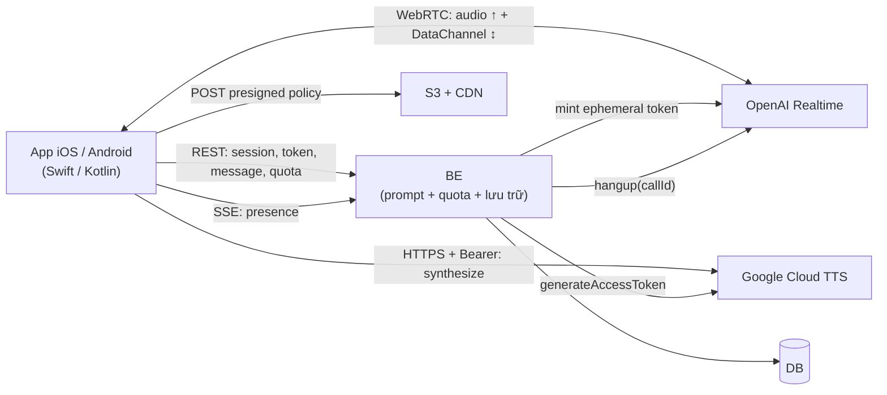

# Chuyển AI Learn từ WebSocket sang WebRTC — đầu việc theo từng đầu

Tài liệu này liệt kê việc phải làm để đưa app AI Learn thật (đang chạy WebSocket: mobile → BE → AI
service) sang kiến trúc WebRTC của repo demo này.

Đọc cùng [`ai-talk-flow.md`](ai-talk-flow.md) — file đó mô tả **hành vi** đích (16 luồng, kèm phần
mobile), file này mô tả **việc phải làm** để tới đó. Số hiệu mục dạng `§4` bên dưới trỏ sang file đó.

---

## 0. Những gì đã chốt

| Câu hỏi | Quyết định |
|---|---|
| AI service còn không? | **Xoá hẳn.** Logic prompt thành module trong BE |
| Stack app | **Native Swift + Kotlin**. Demo trở thành bản đặc tả, viết lại 2 lần |
| "Nhiều nhân vật" | Nhiều nhân vật để **chọn**, mỗi buổi 1 nhân vật — không phải nhiều nhân vật trong cùng buổi |
| Định danh & pro | Đã có tài khoản + IAP. Quota gắn `userId`, không phải `deviceId` |
| Giọng AI | **Google Cloud TTS**, BE cấp access token ngắn hạn, app gọi thẳng |
| Cách chuyển | **Strangler** — WS và WebRTC chạy song song sau cờ, gỡ WS khi version cũ đủ ít |

**Số mode là 3, không phải 4.** `lesson` / `topic` / `free chat`. Nhân vật là chiều vuông góc áp lên
cả ba, không phải mode thứ tư.

---

## 1. Kiến trúc đích



Điểm quyết định: **BE rời khỏi đường nóng.** Nó không còn scale theo số người *đang nói*, mà theo số
người *bắt đầu và kết thúc* buổi học. Đây là lợi ích lớn nhất của việc bỏ WebSocket — lớn hơn cả độ
trễ.

Hệ quả cần nhớ khi thiết kế mọi thứ bên dưới: **BE không nhìn thấy audio nữa.** Mọi cơ chế đếm giờ,
chống lạm dụng, chấm điểm phải dựng lại trên những gì BE *vẫn* thấy — thời điểm mở/đóng call, kênh
presence, và transcript do client gửi lên.

---

## 2. Đầu việc — BE

Nhãn kích cỡ: `[S]` ≈ dưới 2 ngày · `[M]` ≈ 2–5 ngày · `[L]` ≈ trên một tuần. Đây là kích cỡ tương
đối giữa các đầu việc với nhau, không phải cam kết lịch.

### B1. Hấp thụ AI service vào BE `[L]`

Port toàn bộ phần build prompt. Tham chiếu `server/prompt.ts` + `server/tools.ts` của demo.

- [ ] `buildInstructions(mode, scenario, {character, progress, resume})` — 6 khối, **chỉ 1 khối theo mode**:

  | Khối | lesson | topic | free chat |
  |---|---|---|---|
  | Persona (nhân vật) | dùng chung |||
  | Speaking style | dùng chung |||
  | **Mục tiêu buổi nói** | `scenario` + `objectives[]` + `vocabulary[]` + `grammar[]` | `subject` + `talkingPoints[]` + `vocabulary[]` | *rỗng* — chỉ `level` |
  | Correcting mistakes | dùng chung |||
  | Hint escalation | dùng chung |||
  | Tools | `mark_objective` + `end_lesson` | `end_lesson` | *không có tool* |

- [ ] Thứ tự khối **không được đảo**: persona đặt TRƯỚC kịch bản. Đảo lại thì model bám kịch bản và
      bỏ qua tính cách — đổi nhân vật sẽ chỉ còn là đổi giọng.
- [ ] `buildResumeContext()` — nén lượt cũ thành tóm tắt + 6 lượt gần nhất trả nguyên văn qua
      `seedItems`. Kèm khối *"Do NOT greet again. Do NOT restart the scenario. Do NOT apologise."*
- [ ] `buildTranscriptionPrompt()` — prompt cho whisper. Đây là thuốc giải duy nhất cho chuyện whisper
      bịa trên đoạn ghi ngắn; Realtime API không nhận `temperature`.
- [ ] Tool set theo mode. **Free chat mà vẫn khai `mark_objective` là hỏng**: model sẽ gọi nó vào hư
      không và client nhận `function_call` cho objective không tồn tại.
- [ ] Test: snapshot instructions cho từng tổ hợp (3 mode × N nhân vật × {resume, không resume}).

> Xoá AI service là **xoá cả repo/service đó**, không phải để nó chạy không tải. Còn chạy là còn có
> người gọi vào.

### B2. Nhóm endpoint WebRTC, song song với WS `[L]`

Mở nhóm mới cạnh WS cũ, **dùng chung tầng session/quota/lưu trữ**. Bảng tra đầy đủ ở phụ lục
`ai-talk-flow.md`; phần phải viết mới:

| Method | Path | Việc | §  |
|---|---|---|---|
| POST | `/sessions` | tạo buổi, chặn 402 nếu nhân vật `tier=paid` mà user free | 2 |
| POST | `/sessions/:id/token` | **lớp 1 quota** + mint ephemeral OpenAI + cấp grant | 3, 10 |
| POST | `/sessions/:id/tts` | cấp lại riêng access token Google | 5 |
| POST | `/sessions/:id/call` | nhận `callId`, **lớp 2 quota** (`scheduleHangup`) | 3 |
| GET | `/calls/:callId/presence` | SSE, **lớp 3 quota** | 3, 12 |
| POST | `/calls/:callId/end` | đóng call, trừ giờ ngay | 11 |
| POST | `/sessions/:id/messages` | lưu transcript từng lượt | 4, 7 |
| POST | `/sessions/:id/messages/:seq/audio` | confirm object S3 (JSON) hoặc raw body (disk) | 13 |
| POST | `/sessions/:id/progress` | validate `objectiveId` thuộc scenario này → 400 nếu không | 9 |
| POST | `/sessions/:id/end` | chấm điểm | 11 |
| GET | `/quota` | | 2, 12 |

- [ ] Tầng dùng chung phải phục vụ **cả hai** transport ngay từ đầu. Đây là phần refactor nặng nhất
      của B2 — nếu tách đôi thì lúc gỡ WS sẽ phải viết lại lần nữa.
- [ ] **Đơn vị đếm giờ phải thống nhất giữa hai đường.** WS biết chính xác lúc audio chạy; WebRTC thì
      BE chỉ thấy mở/đóng call. Chốt cả hai về **thời gian kết nối thật**
      (`COALESCE(ended_at, now) - started_at`), nếu không thì hai nhóm user chịu hai luật khác nhau.

### B3. Mint ephemeral token OpenAI `[M]`

- [ ] `POST /v1/realtime/client_secrets` với session config:
      `output_modalities: ["text"]` (**không** có nhánh `audio.output` — giọng thuộc về Google),
      `audio.input.transcription: whisper-1 + prompt`, `audio.input.turn_detection: null`,
      `tools`, `tool_choice: "auto"`.
- [ ] API key thật **không bao giờ rời server**. App chỉ cầm secret ngắn hạn, không sửa được luật.
- [ ] Dùng `whisper-1`, **không** `gpt-4o-transcribe`: cái sau là LLM, nó dọn lỗi học viên trước khi
      trả chữ — với app luyện nói thì đó là mất chính cái dữ liệu cần chấm.

### B4. Mint access token Google TTS `[M]`

Đây là chỗ **khác AWS nhiều nhất**, đừng port 1-1 từ `server/sts.ts`.

- [ ] Dùng **IAM Credentials `generateAccessToken`**
      (`iamcredentials.googleapis.com/v1/projects/-/serviceAccounts/{sa}:generateAccessToken`) với
      `lifetime: "900s"`, không dùng SA key ký JWT trực tiếp — BE chạy dưới SA riêng và *impersonate*
      SA của TTS, nên SA key không cần nằm trên đĩa BE.
- [ ] Scope: `https://www.googleapis.com/auth/cloud-platform`. **Cloud TTS không có scope hẹp hơn** —
      cần xác nhận lại lúc làm.
- [ ] Đường xin lại **riêng** (`POST /sessions/:id/tts`), không gọi lại `/token`: `/token` mint client
      secret mới của OpenAI và dựng lại cả ngữ cảnh resume, tất cả bị vứt đi nếu thứ cần chỉ là một
      credential Google.
- [ ] Rate limit cấp token theo `userId`.

> ⚠ **Token của Google không siết được như của AWS.** STS cho gắn session policy + `DateLessThan` +
> `aws:SourceIp`. Access token của service account **không có cái nào trong ba thứ đó** — nó là bearer
> token cho cả SA, và Credential Access Boundary (cơ chế downscope duy nhất của GCP) chỉ áp dụng cho
> Cloud Storage. Token rò ra là gọi được mọi API mà SA đó được phép.
>
> Cách bù, cả bốn đều phải làm: **GCP project riêng chỉ chứa TTS** · SA không có quyền gì khác ·
> **quota cap + budget alert ở cấp project** (đây là cái chặn thiệt hại thật, không phải IAM) ·
> rate limit cấp token theo `userId` ở BE.

### B5. Quota 3 lớp, gắn vào `userId` + entitlement `[M]`

Ba lớp **độc lập**, hỏng một lớp còn hai lớp kia (§12):

| Lớp | Ở đâu | Làm gì |
|---|---|---|
| 1 | `POST /token` | `remainingMs ≤ 0` → 429 `quota_exhausted`, không bắt tay được |
| 2 | `POST /call` | `setTimeout(remainingMs)` → `POST /v1/realtime/calls/:id/hangup` |
| 3 | SSE presence đứt | ân hạn 15s → `hangup(callId, "gone")` |

- [ ] **Lớp 3 phải CẮT, không được chỉ "ngừng đếm".** Presence và WebRTC là hai kết nối độc lập — nếu
      mất presence chỉ làm đồng hồ dừng thì một app sửa vài dòng đóng presence mà giữ WebRTC là gọi
      miễn phí vô hạn. Trên mobile chuyện này còn dễ hơn web.
- [ ] `entitlementFor(userId)` → `{dailyMs, allowedCharacterTiers}`. Free = 5 phút/ngày **tính chung
      cả 3 mode**, không phải 5 phút mỗi mode.
- [ ] **Pro vẫn phải có trần.** Không đặt trần là một user lạm dụng = chi phí không giới hạn. Đề xuất:
      trần ngày *và* trần tháng.
- [ ] `reschedulePendingCalls()` lúc khởi động — server restart mất hết `setTimeout`, nhưng mốc thời
      gian vẫn nằm trong DB.
- [ ] Chốt **múi giờ reset** và trả `resetAt` về client. Không chốt thì client tự đoán, mỗi máy một
      kiểu.

### B6. Schema `scenario` 3 mode + nội dung `[M]`

```
scenario: id, mode, title, level, estimated_minutes, min_turns, speed,
          allow_vietnamese_hint, body (JSON — hình dạng theo mode)
session:  id, user_id, mode, scenario_id (NULL khi free chat), character_code, status, …
```

- [ ] Một bảng với cột `mode` phân biệt, **không phải ba bảng**.
- [ ] `free chat` không có row scenario — `scenario_id = NULL`, `level` lấy từ hồ sơ người học.
- [ ] Soạn nội dung `topic` (mới) — số lượng bao nhiêu là quyết định nội dung, không phải kỹ thuật.
- [ ] Nhân vật: đổi `voice` trong `characters/*.json` từ Polly (`{voiceId, engine}`) sang Google
      (`{languageCode, name}`). Nghe thử lại cả 4 — đổi nhà cung cấp TTS là **đổi giọng nhân vật**,
      người dùng cũ sẽ nhận ra.

### B7. Chấm điểm theo mode `[M]`

- [ ] `lesson`: như demo — chấm theo `objectives` + rubric.
- [ ] `topic`: bỏ cột objectives, giữ grammar/vocabulary/fluency/pronunciation.
- [ ] `free chat`: **bỏ hẳn cột objectives thay vì trả 0 điểm.** Trả 0 là người học tưởng mình làm sai.
- [ ] Giữ `Promise.allSettled` hai nhánh (text + audio): nhánh text hỏng thì ném lỗi, nhánh audio hỏng
      thì chỉ thêm `warnings`.
- [ ] `finishConditionsMet()` theo mode: free chat không có điều kiện nào — nút "Kết thúc" luôn bấm
      được, không có thẻ chúc mừng.

### B8. Cờ transport — kill switch không cần release app `[S]`

- [ ] `GET /api/config` → `{transport: "webrtc" | "ws"}`, quyết định theo `userId` + version app.
- [ ] App **phải đọc cờ này lúc khởi động** và tuân theo. Đây là thứ cho phép rollback trong 5 phút
      thay vì chờ App Store duyệt. Không có nó thì chiến lược strangler mất một nửa giá trị.
- [ ] Dashboard: tỉ lệ version app còn dùng WS — đây là số quyết định *khi nào* gỡ được WS.

### B9. Lưu trữ audio + grant `[M]`

- [ ] `uploadGrant` = presigned **POST policy** cho cả buổi (`starts-with $key` → `audio/:sid/`,
      45B–5MB, hạn 2h). **Không dùng presigned PUT**: PUT ký chết vào một key nên mỗi lượt nói phải
      hỏi server xin URL mới — thêm một round-trip ngay trên đường nóng sau mỗi câu.
- [ ] `verifyKey` — dựng lại key từ `(sessionId, seq, role)` rồi đối chiếu, chặn gán file vào nhầm
      `seq`/`role` trong chính session của mình.
- [ ] Đường `disk`: kiểm tra session thuộc về user của request. Hiện tại phục vụ không kiểm chủ sở hữu
      — web thì URL khó đoán, mobile thì không chấp nhận được.

### B10. Bỏ `deviceId`, chuyển sang `userId` `[S]`

- [ ] `quotaFor()` và toàn bộ đường định danh đọc `userId` từ JWT.
- [ ] Bỏ nhánh cookie `did`. Đã có login thì cookie không còn lý do tồn tại, và giữ lại là để hở một
      đường reset quota bằng cách xoá cookie.

---

## 3. Đầu việc — App (đặc tả dùng chung, hiện thực 2 lần)

Phần này **viết một lần dưới dạng đặc tả**, rồi Swift và Kotlin mỗi bên hiện thực theo. Cột "Demo"
trỏ vào file cần đọc.

| # | Module | Demo | Ghi chú |
|---|---|---|---|
| A1 | Transport WebRTC | `realtime.ts` (193 dòng) | `RTCPeerConnection` + DataChannel `oai-events`. API libwebrtc gần 1-1 với browser |
| A2 | Recorder ring buffer | `recorder.ts` + `pcm-worklet.ts` | PCM 16kHz **liên tục**, cắt sau bằng timestamp |
| A3 | State machine buổi học | `session.ts` (1093 dòng) | **Phần lớn nhất và rủi ro nhất.** PTT, backoff, hint, điểm dừng, cắt/upload |
| A4 | Cắt khúc câu | `chunk.ts` (217 dòng) | Có test |
| A5 | Hàng đợi giọng + client TTS | `speech-queue.ts` + `polly-client.ts` | Đổi Polly → Google, xem 3.2 |
| A6 | Nhép mồm | `fake-mouth.ts` (321 dòng) | Có test |
| A7 | Avatar Spine | `avatar.ts` + `talk-avatar.ts` | spine-cpp / spine-libgdx trên chính file `.skel` + `.atlas.txt` |
| A8 | API client + SSE presence | `api.ts` | Native không có `EventSource` → SSE thủ công **và tự viết vòng retry** |
| A9 | Tốc độ + chờ phát xong | `speed.ts` + `playback.ts` | Có test |
| A10 | Vòng đời OS | **không có trong demo** | Xem 3.3 — phải viết mới hoàn toàn |
| A11 | Màn hình | `main.ts` | Chọn nhân vật / chọn mode / học / tổng kết |

### 3.1 Test port được nguyên xi — dùng làm tiêu chí nghiệm thu

Năm module dưới đây là logic thuần, **đã có test chạy ngoài trình duyệt**. Port test case sang
XCTest / JUnit trước, rồi viết code cho tới khi xanh. Đây là cách rẻ nhất để bản Swift và bản Kotlin
không trôi khỏi nhau.

| Test | Số dòng | Phủ gì |
|---|---|---|
| `shared/speed.test.ts` | 51 | kẹp tốc độ |
| `shared/playback.test.ts` | 135 | chờ `ended`/`error`, đường huỷ |
| `public/src/fake-mouth.test.ts` | 187 | peak trượt, 4 bậc, trễ ngưỡng |
| `public/src/speech-queue.test.ts` | 220 | thứ tự phát, `generation`, failsafe 30s |
| `public/src/polly-client.test.ts` | 196 | ký + retry (phần ký sẽ đổi, phần retry giữ) |

### 3.2 Đổi Polly → Google TTS: khác gì

| | Polly (demo) | Google TTS |
|---|---|---|
| Ký | SigV4, WebCrypto/CryptoKit — **vài trăm dòng** | `Authorization: Bearer <token>` — **một dòng** ✅ |
| Endpoint | `POST /v1/speech` | `POST https://texttospeech.googleapis.com/v1/text:synthesize` |
| Body | `{Text, VoiceId, Engine, OutputFormat}` | `{input:{text}, voice:{languageCode, name}, audioConfig:{audioEncoding:"MP3"}}` |
| Response | mp3 bytes thô | **JSON `{audioContent: "<base64>"}`** — phải decode base64 ⚠ |
| Đồng thời | **1 request một lúc** (h2 `MAX_CONCURRENT_STREAMS=1`, bắn song song là AWS giết cả kết nối) | Không có ràng buộc này → **bỏ được cửa `serial`**, giữ mỗi limiter 3 khúc ✅ |
| Hết hạn | 403 → xin lại grant | như nhau |
| Ràng IP | có (`aws:SourceIp`) | **không có** → mất một lớp bảo vệ ⚠ |

- [ ] Bỏ SigV4 là **thắng lớn nhất** của việc đổi sang Google: nó cắt module crypto nặng nhất khỏi cả
      hai bản native.
- [ ] Nhớ decode base64 — đây là khác biệt dễ quên nhất vì Polly trả bytes thẳng.
- [ ] Đổi tốc độ đọc: **giữ đường `playbackRate`** (iOS `AVAudioUnitTimePitch`, Android
      `PlaybackParams.setSpeed`), **không** dùng `speakingRate` của Google. `speakingRate` nằm trong
      request nên chỉ đổi được từ khúc kế tiếp; `playbackRate` đổi được **giữa chừng một câu**.
- [ ] Không mất gì về khẩu hình: avatar đã nhép fake từ biên độ (§6), không hỏi TTS về âm vị nữa.
      *Nếu sau này quay lại dạy phát âm bằng hình miệng* thì phải bật speech marks — và Google
      **không có** cái tương đương Polly viseme marks. Đó là chi phí chìm của quyết định này, ghi ra
      đây để sau không ngạc nhiên.

### 3.3 Vòng đời OS — phần web không có, phải viết mới (§15)

Đây là phần demo **không giúp được gì**, và cũng là phần hay bị đánh giá thấp nhất.

- [ ] **Trước khi đụng WebRTC**: xin quyền micro · `AVAudioSession .playAndRecord + .voiceChat +
      defaultToSpeaker` (Android: `MODE_IN_COMMUNICATION`, `setSpeakerphoneOn`) · đăng ký interruption
      observer.
- [ ] **Cuộc gọi đến / Siri / báo thức**: `interruption .began` → mute mic, huỷ lượt PTT đang ghi,
      `SpeechQueue.cancel()`. `.ended` → activate lại. Nếu OS đã giết PeerConnection → rơi vào luồng
      reconnect.
- [ ] **Vào background**: hoặc khai `UIBackgroundModes: audio` / `ForegroundService type=microphone`
      (không có thì iOS treo WebRTC sau vài giây và Android 14+ chặn thẳng mic), hoặc chủ động
      `finish("backgrounded")`. **Không được để trạng thái thứ ba** — user bị trừ giờ trong lúc không
      học.
- [ ] **Đổi mạng Wi-Fi ↔ 4G**: `NWPathMonitor` / `ConnectivityManager` → bỏ backoff đầu, reconnect
      NGAY. Đã biết chắc lý do thì không cần đợi 800ms như mất mạng mù.
- [ ] **Kết thúc buổi**: deactivate `AVAudioSession` / `abandonAudioFocus`. Quên là nhạc nền của app
      khác không quay lại được — lỗi này người dùng cảm nhận rất rõ và không ai báo cáo.
- [ ] **Echo cancellation**: bật AEC cấp OS (`.voiceChat` / `JavaAudioDeviceModule` builtin AEC+NS).
      Quan trọng hơn web nhiều vì loa ngoài.

> ⚠ **Rủi ro cần đo sớm:** giọng AI phát qua `AVAudioPlayer`/`ExoPlayer` nằm **ngoài** vòng chống vọng
> của libwebrtc. Trên loa ngoài, tiếng AI có thể vọng ngược vào mic và bay lên OpenAI. Trên iOS,
> AEC của `.voiceChat` áp lên toàn bộ output của audio session nên **có thể** không sao — nhưng đây là
> giả định, không phải sự thật. Đo bằng thiết bị thật, loa ngoài, âm lượng tối đa, **ngay trong tuần
> đầu**. Nếu vọng thật thì lựa chọn còn lại là đẩy audio TTS qua chính audio device của libwebrtc,
> và đó là thay đổi kiến trúc chứ không phải sửa lặt vặt.

### 3.4 Reconnect (§10) — mobile chạy luồng này thường xuyên

- [ ] 5 lần, backoff 0.8s / 2s / 4s / 8s / 15s.
- [ ] `429 quota_exhausted` → **dừng hẳn, không retry.** Retry lúc này chỉ hiện sai nguyên nhân cho
      user suốt 30 giây backoff.
- [ ] Reconnect đi qua đúng đường `#connect()` như lần đầu → cấp lại luôn `uploadGrant` và token
      Google, grant hết hạn giữa buổi tự lành theo.
- [ ] **Bắt buộc truyền `startSeq`** khi học tiếp buổi dở. `saveMessage` upsert theo
      `(session_id, seq)` nên đếm lại từ 0 sẽ **ghi đè chính các lượt cũ**.
- [ ] Seed lại `seedItems` cách nhau 30ms, và **không gọi `response.create` sau khi seed** — quyền mở
      lời vẫn thuộc về user.

---

## 4. Thứ tự làm

Mỗi mốc phải **chạy được và đo được**, không phải "xong module".

| # | Mốc | Xong khi | Chặn cái gì |
|---|---|---|---|
| 0 | **Đo AEC trên thiết bị thật** | Biết chắc tiếng AI có vọng vào mic không | Chặn A5, và có thể chặn cả kiến trúc |
| 1 | BE: B1 + B3 + B4 (prompt, 2 loại token) | `curl` mint được cả hai token | Chặn mọi thứ |
| 2 | BE: B2 + B5 + B6 (endpoint, quota, schema) | Postman chạy hết một buổi giả | Chặn app |
| 3 | **Một app spike, một mode, không avatar** | iOS nói được một lượt qua WebRTC, nghe được giọng Google | Chứng minh kiến trúc |
| 4 | App: A1–A5, A8, A9 + mode `lesson` | Học hết một bài thật, có chấm điểm | |
| 5 | App: A10 vòng đời + A6/A7 avatar | Nghe điện thoại giữa buổi không vỡ | Chặn release |
| 6 | Mode `topic` + `free chat` | | |
| 7 | B8 cờ transport + rollout theo % | Rollback được không cần release | Chặn tắt WS |
| 8 | Bản Android | | |
| 9 | **Gỡ WS + xoá AI service** | Tỉ lệ version cũ dưới ngưỡng đã chốt | |

**Mốc 0 và mốc 3 là hai cái phải làm sớm nhất**, dù chúng không sinh ra tính năng nào. Cả hai đều là
câu hỏi "kiến trúc này có chạy không" — trả lời muộn thì trả lời lúc đã viết xong 3000 dòng.

---

## 5. Rủi ro đã biết

| Rủi ro | Mức | Xử lý |
|---|---|---|
| Tiếng AI vọng vào mic qua loa ngoài | **Cao** | Đo ở mốc 0. Dự phòng: đẩy TTS qua audio device của libwebrtc |
| Token Google không siết được như STS | **Cao** | Project riêng + quota cap + rate limit (B4) |
| `session.ts` 1093 dòng viết lại 2 lần, hai bản trôi khỏi nhau | **Cao** | Port test trước (3.1); mọi sửa hành vi phải sửa đặc tả trước |
| Đổi TTS = đổi giọng nhân vật, user cũ nhận ra | Trung bình | Nghe thử cả 4 trước khi chốt mapping giọng (B6) |
| Chi phí | Trung bình | ~$0.18/buổi 5 phút, ~$5.4k/tháng ở 1.000 DAU — xem [`cost.md`](cost.md). Số này tính theo Polly; **phải tính lại theo giá Google** |
| App cũ chết khi tắt WS | Trung bình | Cờ transport (B8) + theo dõi tỉ lệ version |
| Android 14+ chặn mic ở background | Trung bình | `ForegroundService type=microphone`, làm ở A10 |

---

## 6. Không làm (YAGNI)

Ghi ra để sau không ai "bổ sung cho đủ":

- **Nhiều nhân vật trong cùng một buổi.** Cần trọng tài lượt nói, nhiều giọng song song, nhiều avatar.
  Không nằm trong yêu cầu.
- **Đổi nhân vật giữa chừng.** Cần reconnect + reseed với instructions mới.
- **Viseme chuẩn âm vị.** Đã bỏ ở `89979c8`, và Google không có cái tương đương speech marks.
- **Lưu giọng AI mặc định.** Nghe lại thì đọc lại từ text — rẻ hơn lưu file.
- **Chấm phát âm mặc định.** Bật bằng env khi cần; tắt thì `pronunciation = null` và `overall` là
  trung bình ba điểm text, **không phải lỗi**.
- **Giữ WS cho một mode nào đó "cho chắc".** Nuôi hai đường nóng vô thời hạn.

---

## 7. Còn phải chốt

Bốn chỗ dưới đây tôi chưa có đủ thông tin để quyết, và cả bốn đều ảnh hưởng tới việc phải làm:

1. **Trần của user pro** — bao nhiêu phút/ngày và có trần tháng không.
2. **Múi giờ reset quota** và cách hiển thị `resetAt`.
3. **Số lượng + nội dung scenario mode `topic`** — quyết định nội dung, không phải kỹ thuật.
4. **Ngưỡng tỉ lệ version cũ** để được phép tắt WS ở mốc 9.
